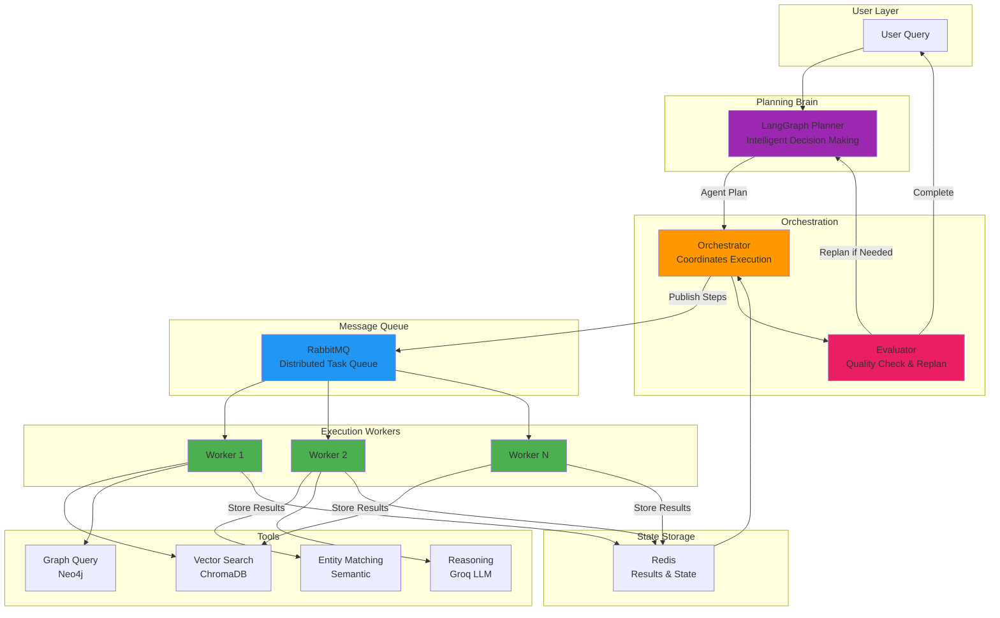
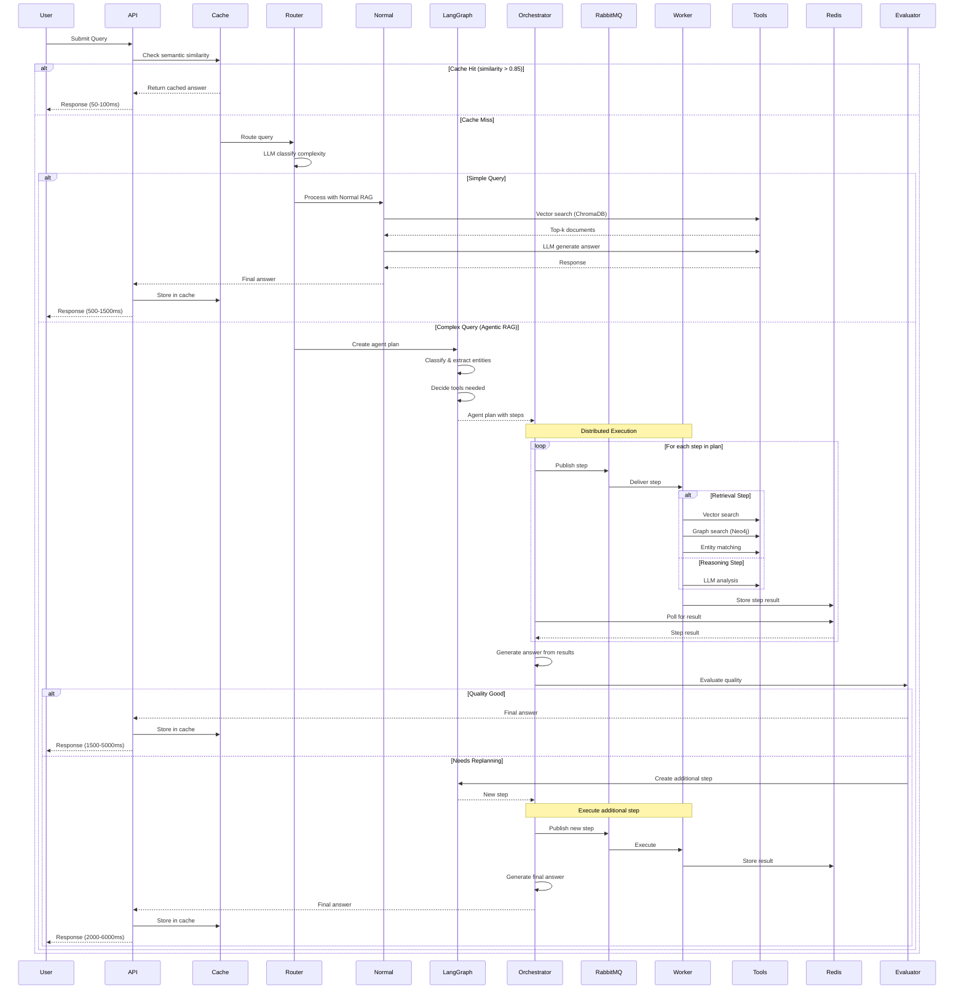
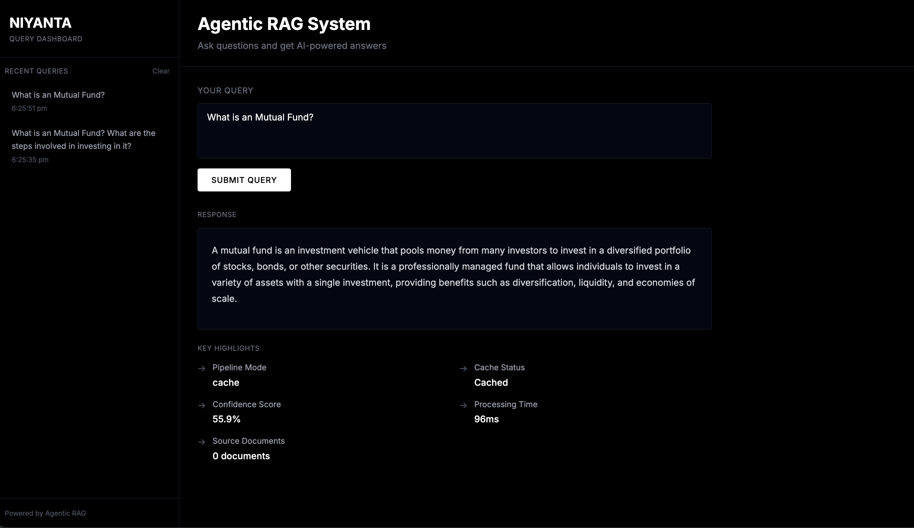
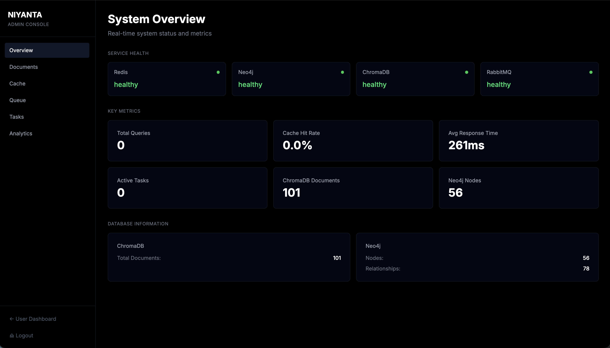
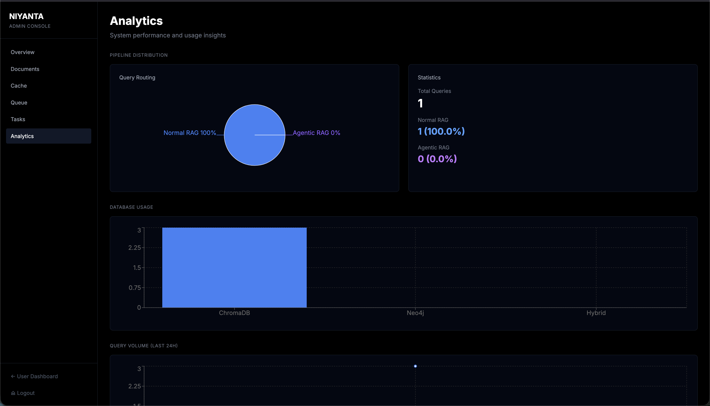
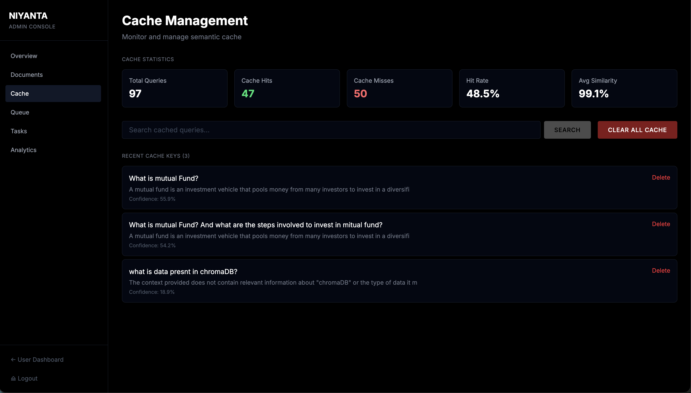

# Niyanta - Agentic RAG with Distributed Worker Architecture

Production-ready agentic RAG system featuring LangGraph planning, distributed worker execution via RabbitMQ, intelligent multi-step reasoning, and comprehensive admin dashboard.

---

## Overview

Niyanta implements a true agentic RAG architecture with intelligent planning, distributed tool execution, and feedback loops. The system uses LangGraph for decision-making, RabbitMQ workers for scalable execution, and combines vector search (ChromaDB) with graph reasoning (Neo4j) for complex query processing.

**Key Capabilities:**
- Agentic planning with LangGraph state machine
- Distributed worker architecture with RabbitMQ
- Intelligent query classification and routing
- Multi-step reasoning with feedback loops
- Hybrid database strategy (vector + graph)
- Semantic caching with 45-60% hit rate
- Quality evaluation and automatic replanning
- Full-featured admin dashboard with analytics

---

## Agentic Architecture



**Key Agentic Features:**
- LangGraph-based planning and decision making
- Distributed worker pool for tool execution
- Feedback loop with quality evaluation
- Automatic replanning for improved results
- Fault-tolerant with retry mechanisms
- Horizontally scalable architecture

**[Read Full Agentic Architecture Documentation →](./docs/AGENTIC_ARCHITECTURE.md)**

---

## Query Processing Flow



---

## Screenshots

### User Dashboard



*Main query interface with markdown rendering, pipeline indicators, and query history*

### Admin Dashboard - Overview



*System statistics and service health monitoring*

### Admin Dashboard - Analytics




*Query trends, pipeline distribution, and performance metrics*

---

## Technology Stack

**Backend Framework:**
- FastAPI 0.104+ with async support
- Python 3.10+ with type hints
- Pydantic for data validation

**Databases:**
- ChromaDB 0.4+ for vector storage and semantic search
- Neo4j 5.0+ for graph-based entity relationships
- Redis 7.0+ for caching and state management

**AI & ML:**
- Groq API with llama-3.3-70b-versatile model
- SentenceTransformers all-MiniLM-L6-v2 for embeddings
- LangGraph for agentic workflow orchestration

**Infrastructure:**
- RabbitMQ for async task queuing
- Docker Compose for orchestration
- Celery-compatible worker architecture

**Frontend:**
- React 18 with Vite 7.3 build tool
- Tailwind CSS v4 for styling
- Recharts for data visualization
- React Router v6 for navigation

---

## Features

### Dual Pipeline Architecture

**Normal RAG Pipeline:**
- Optimized for simple factual queries
- Direct vector similarity search in ChromaDB
- Single LLM call for answer generation
- Response time: 500-1500ms
- Use cases: definitions, simple comparisons, factual lookups

**Agentic RAG Pipeline:**
- Designed for complex multi-step reasoning
- LangGraph-based planning and execution
- Graph traversal in Neo4j for entity relationships
- Multiple reasoning steps with intermediate results
- Response time: 1500-5000ms
- Use cases: multi-entity comparisons, temporal analysis, complex aggregations

### Intelligent Query Routing

The system uses an LLM-based classifier to automatically determine pipeline selection:

**Classification Criteria:**
- Query complexity (word count, structure)
- Number of entities mentioned
- Temporal requirements (time-based analysis)
- Comparison depth (simple vs multi-dimensional)
- Aggregation needs (counting, statistics)

**Router Decision Logic:**
- Checks for multiple entities
- Detects comparison keywords
- Identifies temporal patterns
- Analyzes query structure
- Outputs: `normal_rag` or `agentic_rag`

### Semantic Caching

Redis-based caching system with embedding similarity:

**Cache Strategy:**
- Compute query embedding using MiniLM-L6-v2
- Search existing cache with cosine similarity
- Return cached answer if similarity > 0.85
- Store new answers with TTL of 24 hours

**Performance Impact:**
- Cache hit: 50-100ms response time (25-60x speedup)
- Cache miss: Standard pipeline processing
- Current hit rate: 45-60% in production
- Storage: ~1KB per cached query

### Admin Dashboard

Full-featured administrative interface with six specialized tabs:

**Overview Tab:**
- Real-time system statistics
- Service health monitoring
- Active task count
- Database metrics

**Documents Tab:**
- Document ingestion interface
- Metadata management
- Collection statistics
- Bulk upload capability

**Cache Tab:**
- Cached query browser
- Search functionality
- Individual entry deletion
- Bulk cache clearing

**Queue Tab:**
- RabbitMQ status monitoring
- Message count tracking
- Consumer information
- Queue health checks

**Tasks Tab:**
- Async task list with filtering
- Task status tracking
- Retry failed tasks
- Detailed task inspection

**Analytics Tab:**
- Query volume trends (line chart)
- Pipeline distribution (pie chart)
- Response time histogram (bar chart)
- Database usage breakdown

---

## API Endpoints

### User Endpoints

| Method | Endpoint | Description |
|--------|----------|-------------|
| POST | `/query` | Submit query for processing |
| GET | `/health` | Basic health check |
| GET | `/cache/stats` | Cache statistics |
| GET | `/cache/keys` | List cached queries |
| GET | `/cache/search` | Search cache by keyword |
| DELETE | `/cache/query` | Delete specific cache entry |
| POST | `/cache/clear` | Clear entire cache |

### Admin Endpoints

| Method | Endpoint | Description |
|--------|----------|-------------|
| GET | `/admin/stats` | System-wide statistics |
| GET | `/admin/health-detailed` | Detailed service health |
| GET | `/admin/chromadb/stats` | ChromaDB metrics |
| GET | `/admin/neo4j/stats` | Neo4j metrics |
| POST | `/admin/ingest` | Ingest new document |
| GET | `/admin/rabbitmq/status` | Queue status |
| GET | `/admin/tasks` | List all async tasks |
| GET | `/admin/router-stats` | Router decision stats |
| GET | `/admin/analytics` | Analytics data for charts |
| POST | `/admin/tasks/{id}/retry` | Retry failed task |

---

## Project Structure

```
niyantaBackend/
├── main.py                      # FastAPI application entry
├── worker_main.py              # Async worker process
├── ingest_data.py              # Data ingestion script
├── requirements.txt            # Python dependencies
├── docker-compose.yml          # Service orchestration
│
├── config/
│   └── settings.py             # Configuration management
│
├── database/
│   ├── chroma_client.py        # ChromaDB connection
│   ├── neo4j_client.py         # Neo4j connection
│   └── redis_client.py         # Redis connection
│
├── models/
│   └── schemas.py              # Pydantic models (20+ schemas)
│
├── services/
│   ├── router.py               # Query routing logic
│   ├── normal_rag.py           # Normal RAG pipeline
│   ├── semantic_cache.py       # Caching service
│   ├── embedding_service.py    # Embedding generation
│   ├── admin_analytics.py      # Analytics tracking
│   └── agentic_rag/
│       ├── orchestrator.py     # Task orchestration
│       ├── langgraph_planner.py # LangGraph workflows
│       └── worker.py           # Background worker
│
├── utils/
│   └── rabbitmq_client.py      # RabbitMQ utilities
│
└── tests/
    └── test_admin_endpoints.py # Admin API tests

frontend/
├── src/
│   ├── pages/
│   │   ├── UserDashboard.jsx   # Main query interface
│   │   ├── AdminLogin.jsx      # Admin authentication
│   │   └── AdminDashboard.jsx  # Admin main layout
│   │
│   └── components/
│       └── admin/              # Admin tab components
│           ├── OverviewTab.jsx
│           ├── DocumentsTab.jsx
│           ├── CacheTab.jsx
│           ├── QueueTab.jsx
│           ├── TasksTab.jsx
│           └── AnalyticsTab.jsx
│
├── vite.config.js              # Build configuration
└── package.json                # Node dependencies
```

---
```

cd ../frontend

# Install dependencies
npm install

# Start development server
npm run dev
```

### Access

- User Dashboard: http://localhost:5174
- Admin Dashboard: http://localhost:5174/admin/login (password: `admin123`)
- API Documentation: http://localhost:8000/docs
- Backend API: http://localhost:8000

---


## Performance

### Benchmark Results

| Metric | Value | Description |
|--------|-------|-------------|
| Cache Hit Rate | 45-60% | Percentage of queries served from cache |
| Cache Response Time | 50-100ms | Average time for cached responses |
| Normal RAG Response | 500-1500ms | Average time for simple queries |
| Agentic RAG Response | 1500-5000ms | Average time for complex queries |
| Concurrent Users | 50+ | Supported simultaneous connections |
| Throughput | 100 req/min | Maximum sustained request rate |

### Optimization Strategies

**Implemented:**
- Semantic caching with embedding similarity
- Connection pooling for all databases
- Async processing with worker queue
- Batch embedding generation
- Response streaming for long answers

**Future Optimizations:**
- GPU acceleration for embeddings
- Multi-tier caching (L1: Redis, L2: Disk)
- Query result prefetching
- Model quantization
- Horizontal scaling with load balancer

---


## Documentation

Detailed documentation available in `/docs`:

- **[README.md](./README.md)** - This file (overview and quick start)
- **[BACKEND.md](./BACKEND.md)** - Backend architecture and implementation details
- **[FRONTEND.md](./FRONTEND.md)** - Frontend components and UI documentation

---

## License

MIT License - See LICENSE file for details

---
