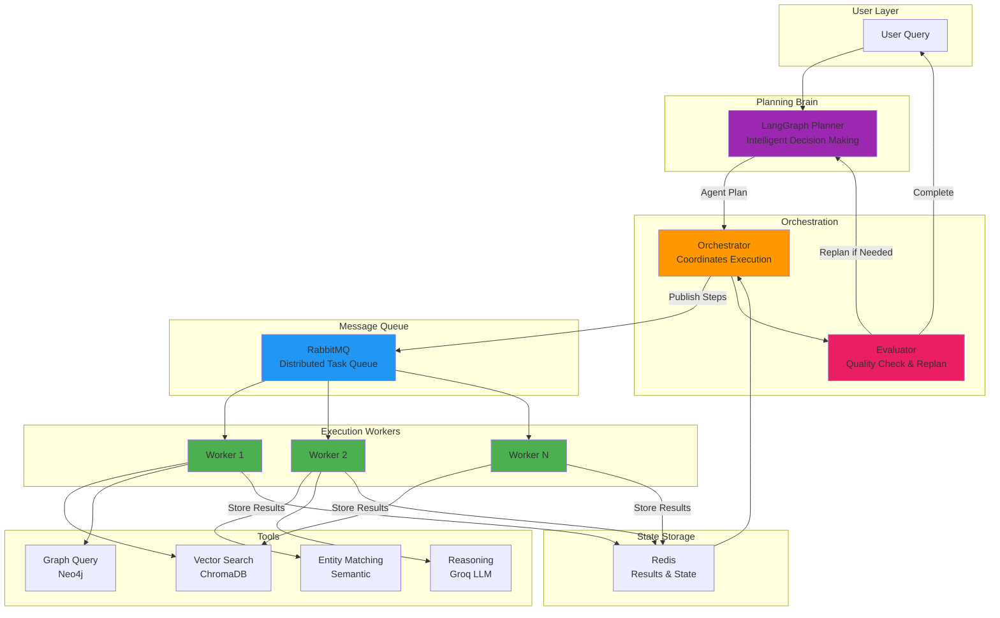
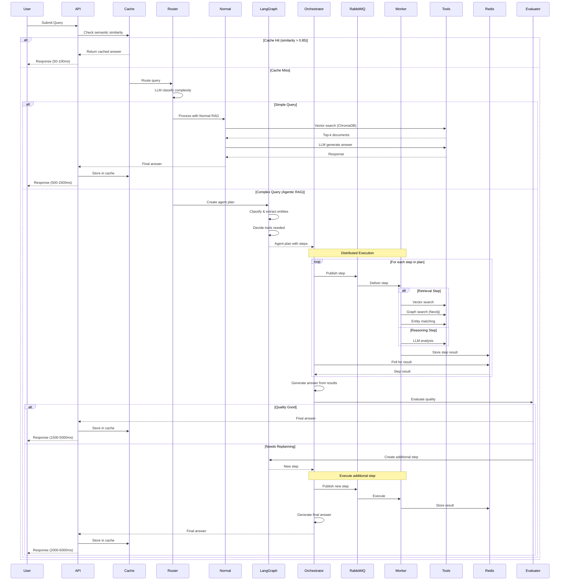

# Niyanta - Agentic RAG with Knowledge Ingestion & Distributed Worker Architecture

Production-ready agentic RAG system with a full knowledge ingestion layer. Ingest content from GitHub repos, webpages, PDFs, YouTube, Reddit, and RSS feeds — then ask questions and get cited answers powered by hybrid search, knowledge graphs, and LangGraph-based agentic reasoning.

---

## Overview

Niyanta is a knowledge ingestion and Q&A platform. You point it at any source — a GitHub repo, a documentation site, a PDF, a YouTube video, a Reddit thread, or an RSS feed — and it extracts, chunks, embeds, and indexes the content. From there you can ask natural language questions and get answers with citations, explore the knowledge graph of entities and relationships, or generate digests summarizing what happened in a source over a time period.

Under the hood the system uses LangGraph for intent-aware planning, *RabbitMQ* workers for scalable execution, ChromaDB for vector search, Neo4j for graph traversal, and a cross-encoder re-ranker for relevance scoring. A *Redis* semantic cache keeps repeated queries fast.

---

## Agentic Architecture



**Key Agentic Features:**
- LangGraph-based planning and decision making
- Distributed worker pool for tool execution
- Feedback loop with quality evaluation
- Automatic replanning for improved results
- Fault-tolerant with retry mechanisms
- Horizontally scalable architecture

**[Read Full Agentic Architecture Documentation →](./docs/AGENTIC_ARCHITECTURE.md)**

---

## Query Processing Flow



---

## Screenshots

### User Dashboard


*Main query interface with markdown rendering, pipeline indicators, and query history*

### Admin Dashboard - Overview


*System statistics and service health monitoring*

### Admin Dashboard - Analytics


*Query trends, pipeline distribution, and performance metrics*

---

**What you can do:**
- Ingest any of 6 source types with a single URL or PDF upload
- Ask questions — answers cite the exact issue, PR, page, or timestamp they came from
- Explore an interactive D3 knowledge graph of entities and relationships
- Generate AI digests summarizing recent activity in a source
- Filter queries to a specific source or workspace
- View the full admin dashboard with analytics, cache management, and queue monitoring

**Key Capabilities:**
- 6-source ingestion layer (GitHub, Web, PDF, YouTube, Reddit, RSS)
- Semantic metadata enrichment at ingest time (intent tags, temporal buckets, quality scores)
- Hybrid retrieval: vector search + keyword search + Neo4j graph traversal
- Reciprocal Rank Fusion (RRF) to combine retrieval results
- Cross-encoder re-ranking for relevance scoring
- Intent-aware query routing (decision / fix / temporal / explanation / opinion)
- Resolution chain traversal (issue → PR → file chains in Neo4j)
- Workspace management to organize sources by project
- Agentic planning with LangGraph state machine
- Distributed worker architecture with RabbitMQ
- Semantic caching with 45-60% hit rate
- Interactive knowledge graph visualization (D3 force-directed)
- Full-featured admin dashboard with analytics
- Kubernetes-ready with horizontal pod autoscaling

## Technology Stack

**Backend Framework:**
- FastAPI 0.109+ with async support
- Python 3.10+ with type hints
- Pydantic v2 for data validation

**Databases:**
- ChromaDB 0.4+ for vector storage and semantic search
- Neo4j 5.0+ for knowledge graph (entities + relationships)
- Redis 7.0+ for caching, state management, and ingestion tracking

**AI & ML:**
- Groq API with `llama-3.3-70b-versatile` for answer generation
- SentenceTransformers `all-MiniLM-L6-v2` for embeddings
- `cross-encoder/ms-marco-MiniLM-L-6-v2` for re-ranking
- LangGraph for agentic workflow orchestration
- `rank-bm25` for keyword search

**Ingestion Libraries:**
- `httpx` — async HTTP for GitHub API, web scraping, Reddit JSON API
- `beautifulsoup4` + `lxml` — HTML parsing and content extraction
- `feedparser` — RSS/Atom feed parsing
- `youtube-transcript-api` — YouTube transcript fetching (no API key needed)
- `pymupdf` (fitz) — PDF text extraction per page

**Infrastructure:**
- RabbitMQ for async task queuing
- Docker Compose for local infrastructure
- Kubernetes manifests for production deployment

**Frontend (ingestion-frontend):**
- React 18 with Vite 5
- Tailwind CSS with Playfair Display + DM Sans + DM Mono fonts
- D3.js v7 for knowledge graph visualization
- React Router v6
- react-markdown + remark-gfm for answer rendering

**Frontend (admin frontend):**
- React 18 with Vite 7.3
- Tailwind CSS v4
- Recharts for analytics charts
- D3.js v7 for knowledge graph tab

**Monitoring & Observability:**
- Prometheus for metrics (40+ custom metrics)
- Grafana for dashboards
- Loki + Promtail for log aggregation
- Built-in `/metrics` endpoint

---

## Kubernetes Orchestration

Scalable deployment with automatic resource management and self-healing:

**Kubernetes Features:**
- **Horizontal Pod Autoscaling (HPA):** Auto-scale workers based on queue depth and CPU
- **StatefulSets:** Ordered deployment for databases with persistent storage
- **Health Checks:** Liveness and readiness probes for automatic recovery
- **Rolling Updates:** Zero-downtime deployments with gradual rollout
- **Resource Requests/Limits:** CPU and memory management for node optimization
- **Persistent Volumes:** Data persistence across pod restarts
- **Multi-Environment:** Separate namespaces for dev/staging/prod

---

## Observability & Monitoring

Comprehensive monitoring stack for production visibility:

**Metrics Collection (Prometheus):**
- HTTP request rates and latency histograms
- Active worker count and task completion rates
- Cache hit/miss ratios and performance
- RAG pipeline execution time tracking
- Database connection pool statistics
- Error tracking by type and service
- Custom business metrics (40+ total)

**Log Aggregation (Loki + Promtail):**
- Centralized log collection from all services
- Docker container logs auto-discovered
- Searchable logs in Grafana interface
- 24-hour retention with efficient storage

**Visualization (Grafana):**
- Pre-configured System Overview dashboard
- HTTP request rate monitoring
- Worker performance tracking
- Task completion metrics
- Cache efficiency visualization
- Error rate monitoring
- All accessible at http://localhost:3000

**Architecture:**
```
Application (40+ metrics) → Prometheus (9090)
                         ↓
                      Grafana (3000)
                         ↓
              [System Overview Dashboard]

Docker Logs → Promtail → Loki (3100)
                         ↓
                      Grafana
```

**Quick Start:**
```bash
cd docker
docker-compose up -d prometheus grafana loki promtail redis-exporter
# Access Grafana at http://localhost:3000 (admin/admin)
```

**Monitoring in Admin Dashboard:**
- Integrated monitoring tabs (Overview, Analytics, Queue, Tasks, Cache, Documents)
- Real-time system health and statistics
- Query performance trends
- Pipeline distribution analysis
- Quick access to Grafana dashboards via "📊 View Metrics" link

**Production Observability:**
- **Prometheus Targets:** Backend API, workers, Redis, RabbitMQ, Kubernetes metrics
- **Prometheus Storage:** 15-day retention with persistent volumes
- **Grafana Dashboards:** System Overview, Pod metrics, Queue analysis, Error tracking
- **Loki Labels:** container, service, pod, namespace, environment
- **Alert Rules:** High latency, error spikes, resource exhaustion, queue backlog
- **SLA Tracking:** Response time SLOs, availability SLOs, error budgets

**Metrics for Scaling Decisions:**
- Worker queue depth (RabbitMQ messages pending)
- Backend API response time (p95, p99)
- Cache hit rate trends
- Database query duration
- Memory and CPU utilization

**[Read Full Monitoring Documentation →](./docker/MONITORING.md)**

--- 

**Scaling Behavior:**
- **Scale Up:** When metric threshold exceeded, add pod every 60 seconds (max 4 pods)
- **Scale Down:** When below threshold for 5 minutes, remove pod every 60 seconds
- **Rapid Recovery:** Queue depth >100 → trigger immediate scaling

**[Read Full Kubernetes Documentation →](./docs/DEPLOYMENT.md)**

---

## Features

### Knowledge Ingestion Layer

Six source types, all triggered by a single URL or file upload:

| Source | What Gets Ingested | Graph Entities |
|--------|-------------------|----------------|
| **GitHub Repo** | README, issues, PRs, commits, CHANGELOG | repo, author, label nodes + RESOLVES/TAGGED/CREATED edges |
| **Webpage** | Main content, title, description | website domain node |
| **PDF** | Full text per page, chunked | pdf_document node |
| **YouTube** | Full transcript in 500-word chunks | channel, video nodes + PUBLISHED edge |
| **Reddit** | Post + top 50 comments ranked by score | subreddit, reddit_user nodes |
| **RSS Feed** | Entries from last 30 days with tags | rss_feed node |

**Semantic enrichment at ingest time** — every chunk gets 5 metadata fields stored in ChromaDB:

- `intent_tags` — what kind of content this is: `decision`, `fix`, `problem`, `explanation`, `reference`, `opinion`, `changelog`, `feature_request`, `question`, `discussion`, `feed`
- `source_category` — `code` / `documentation` / `discussion` / `community` / `media` / `feed`
- `content_quality` — 0.0–1.0 score (Reddit uses upvote count, commits use message length, etc.)
- `temporal_bucket` — `today` / `this_week` / `this_month` / `this_year` / `older` / `unknown`
- `entities_mentioned` — pipe-separated key terms for BM25 exact matching (`issue#234|@tj|body-parser`)

### Hybrid Search & Re-ranking

Queries run three search methods in parallel, then combine and re-rank:

1. **Vector search** (ChromaDB) — semantic similarity via MiniLM-L6-v2 embeddings
2. **keyword search** — exact term matching using `rank-bm25`, catches `issue#234`, `@mentions`, `` `backtick terms` ``
3. **Graph traversal** (Neo4j) — entity neighborhood expansion via semantic entity matching

Results are combined with **Reciprocal Rank Fusion (RRF)**, then re-ranked by a **cross-encoder** (`cross-encoder/ms-marco-MiniLM-L-6-v2`) for final relevance scoring.

### Intent-Aware Retrieval

The LangGraph planner detects query intent from keywords and routes to the right retrieval strategy:

| Query pattern | Retrieval mode | What it does |
|--------------|---------------|-------------|
| "how was X fixed / resolved" | `resolution_chain` | Follows issue → PR → file chains in Neo4j |
| "why / decided / because / approach" | `source_aware` | Filters to `decision` + `discussion` chunks |
| "recent / latest / this week / changed" | `temporal` | Filters to `today` + `this_week` temporal buckets |
| "bug / error / broken / problem" | `source_aware` | Filters to `problem` + `fix` chunks |
| "what is / explain / how does" | `source_aware` | Filters to `explanation` + `reference` chunks |
| "think / opinion / recommend" | `source_aware` | Filters to `opinion` + `community` chunks |
| anything else | `hybrid_reranked` | Full hybrid search, no tag filter |

### Dual Pipeline Architecture

**Normal RAG Pipeline:**
- Optimized for simple factual queries
- Direct vector similarity search in ChromaDB
- Single LLM call for answer generation
- Response time: 500-1500ms
- Use cases: definitions, simple comparisons, factual lookups

**Agentic RAG Pipeline:**
- Designed for complex multi-step reasoning
- LangGraph-based planning and execution
- Graph traversal in Neo4j for entity relationships
- Multiple reasoning steps with intermediate results
- Response time: 1500-5000ms
- Use cases: multi-entity comparisons, temporal analysis, complex aggregations

### Intelligent Query Routing

The system uses an LLM-based classifier to automatically determine pipeline selection:

**Classification Criteria:**
- Query complexity (word count, structure)
- Number of entities mentioned
- Temporal requirements (time-based analysis)
- Comparison depth (simple vs multi-dimensional)
- Aggregation needs (counting, statistics)

**Router Decision Logic:**
- Checks for multiple entities
- Detects comparison keywords
- Identifies temporal patterns
- Analyzes query structure
- Outputs: `normal_rag` or `agentic_rag`

### Semantic Caching

Redis-based caching system with embedding similarity:

**Cache Strategy:**
- Compute query embedding using MiniLM-L6-v2
- Search existing cache with cosine similarity
- Return cached answer if similarity > 0.85
- Store new answers with TTL of 24 hours

---

<!-- ## API Endpoints

### Ingestion Endpoints

| Method | Endpoint | Description |
|--------|----------|-------------|
| POST | `/ingest/url` | Start ingestion of a URL (GitHub, webpage, YouTube, Reddit, RSS) |
| POST | `/ingest/pdf` | Upload and ingest a PDF file |
| GET | `/ingest/status/{id}` | Poll ingestion progress |
| GET | `/ingest/list` | List all ingested sources |
| DELETE | `/ingest/{id}` | Delete a source from all databases |
| POST | `/digest` | Generate AI digest of an ingested source |

### Graph Endpoints

| Method | Endpoint | Description |
|--------|----------|-------------|
| GET | `/graph/financial` | Financial domain graph (or all ingested if no financial data) |
| GET | `/graph/source/{ingestion_id}` | Graph for a specific ingested source |
| GET | `/graph/entity/{name}` | Entity neighborhood up to N hops |
| GET | `/graph/path?from_entity=&to_entity=` | Shortest path between two entities |
| GET | `/graph/stats/{ingestion_id}` | Node/edge counts and most-connected nodes |

### Workspace Endpoints

| Method | Endpoint | Description |
|--------|----------|-------------|
| POST | `/workspaces` | Create a workspace |
| GET | `/workspaces` | List all workspaces |
| GET | `/workspaces/{id}` | Get workspace with ingestions |
| PUT | `/workspaces/{id}` | Update workspace name/description |
| DELETE | `/workspaces/{id}` | Delete workspace |
| POST | `/workspaces/{id}/ingestions` | Add ingestion to workspace |
| DELETE | `/workspaces/{id}/ingestions/{ing_id}` | Remove ingestion from workspace |
| GET | `/workspaces/{id}/stats` | Workspace statistics |

### User Endpoints

| Method | Endpoint | Description |
|--------|----------|-------------|
| POST | `/query` | Submit query (supports `workspace_id`, `source_filter`) |
| GET | `/health` | Basic health check |
| GET | `/cache/stats` | Cache statistics |
| GET | `/cache/keys` | List cached queries |
| GET | `/cache/search` | Search cache by keyword |
| DELETE | `/cache/query` | Delete specific cache entry |
| POST | `/cache/clear` | Clear entire cache |

### Admin Endpoints

| Method | Endpoint | Description |
|--------|----------|-------------|
| GET | `/admin/stats` | System-wide statistics |
| GET | `/admin/health-detailed` | Detailed service health |
| GET | `/admin/chromadb/stats` | ChromaDB metrics |
| GET | `/admin/neo4j/stats` | Neo4j metrics |
| POST | `/admin/ingest` | Ingest a raw document |
| GET | `/admin/rabbitmq/status` | Queue status |
| GET | `/admin/tasks` | List all async tasks |
| GET | `/admin/router-stats` | Router decision stats |
| GET | `/admin/analytics` | Analytics data for charts |
| POST | `/admin/tasks/{id}/retry` | Retry failed task |
-->
---

## Project Structure

```
backend/
├── main.py                          # FastAPI app — all endpoints
├── worker_main.py                   # Async worker process
├── requirements.txt                 # Python dependencies
├── docker-compose.local.yml         # Local dev: Redis, RabbitMQ, Neo4j
│
├── config/
│   └── settings.py                  # All configuration via env vars
│
├── database/
│   ├── chroma_client.py             # ChromaDB (vector store)
│   ├── neo4j_client.py              # Neo4j (knowledge graph)
│   └── redis_client.py              # Redis (cache + state)
│
├── models/
│   ├── schemas.py                   # Core Pydantic models (QueryRequest, AgentPlan, etc.)
│   ├── ingestion_schemas.py         # Ingestion models + GraphNode/Edge/Response
│   └── workspace_schemas.py         # Workspace models
│
├── routers/
│   └── graph_router.py              # /graph/* endpoints (visualization)
│
├── services/
│   ├── router.py                    # Query routing (normal vs agentic)
│   ├── normal_rag.py                # Normal RAG pipeline
│   ├── improved_rag.py              # Hybrid search + re-ranking pipeline
│   ├── hybrid_retriever.py          # Vector + BM25 + graph retrieval + RRF
│   ├── reranker.py                  # Cross-encoder re-ranking
│   ├── semantic_cache.py            # Embedding-based cache
│   ├── embedding_service.py         # MiniLM-L6-v2 embeddings
│   ├── entity_matcher.py            # Semantic entity matching for Neo4j
│   ├── digest_service.py            # AI digest generation
│   ├── workspace_service.py         # Workspace CRUD
│   ├── admin_analytics.py           # Analytics tracking
│   │
│   ├── ingestion/
│   │   ├── ingestion_pipeline.py    # Main coordinator (routes to ingesters)
│   │   ├── url_detector.py          # Detects source type from URL
│   │   ├── github_ingester.py       # GitHub REST API (README, issues, PRs, commits)
│   │   ├── web_ingester.py          # BeautifulSoup scraper + recursive crawler
│   │   ├── reddit_ingester.py       # Reddit public JSON API
│   │   ├── youtube_ingester.py      # youtube-transcript-api + oEmbed metadata
│   │   ├── rss_ingester.py          # feedparser
│   │   ├── pdf_ingester.py          # PyMuPDF (fitz)
│   │   └── tagging_utils.py         # compute_temporal_bucket, extract_key_terms
│   │
│   └── agentic_rag/
│       ├── orchestrator.py          # Coordinates planning + execution
│       ├── langgraph_planner.py     # LangGraph state machine + intent detection
│       └── worker.py                # RabbitMQ consumer — intent-aware retrieval
│
└── utils/
    ├── rabbitmq_client.py           # RabbitMQ publish/consume
    └── metrics.py                   # Prometheus middleware

ingestion-frontend/                  # Standalone ingestion UI (port 3000)
├── src/
│   ├── pages/
│   │   ├── HomePage.jsx             # Landing page with animations
│   │   ├── SourcesPage.jsx          # Ingest form + source cards
│   │   ├── ChatPage.jsx             # Q&A chat interface
│   │   └── KnowledgeGraphPage.jsx   # Interactive D3 graph
│   ├── components/
│   │   ├── Layout.jsx               # Sticky header + nav
│   │   ├── SourceCard.jsx           # Source card with MiniGraph toggle
│   │   ├── MiniGraph.jsx            # Compact D3 graph for source cards
│   │   ├── DigestModal.jsx          # Digest display modal
│   │   └── SourceFilter.jsx         # Source selector dropdown
│   └── constants/
│       └── graphColors.js           # Shared D3 color constants

frontend/                            # Admin frontend (port 5173)
├── src/
│   ├── pages/
│   │   ├── UserDashboard.jsx        # Main query interface
│   │   ├── AdminDashboard.jsx       # Admin layout with 8 tabs
│   │   ├── AdminLogin.jsx           # Admin auth
│   │   └── IngestionPage.jsx        # Ingestion manager with MiniGraph
│   ├── components/
│   │   └── admin/
│   │       ├── OverviewTab.jsx      # System stats + "View Graph" link
│   │       ├── KnowledgeGraphTab.jsx # Full interactive D3 graph
│   │       ├── AnalyticsTab.jsx
│   │       ├── CacheTab.jsx
│   │       ├── QueueTab.jsx
│   │       ├── TasksTab.jsx
│   │       └── DocumentsTab.jsx
│   └── constants/
│       └── graphColors.js           # Shared D3 color constants
```

---
```

cd ../frontend

# Install dependencies
npm install

# Start development server
npm run dev
```

### Access

- User Dashboard: http://localhost:5174
- Admin Dashboard: http://localhost:5174/admin/login (password: `admin123`)
- API Documentation: http://localhost:8000/docs
- Backend API: http://localhost:8000

---


## Performance

### Benchmark Results

| Metric | Value | Description |
|--------|-------|-------------|
| Cache Hit Rate | 45-60% | Percentage of queries served from cache |
| Cache Response Time | 50-100ms | Average time for cached responses |
| Normal RAG Response | 500-1500ms | Average time for simple queries |
| Agentic RAG Response | 1500-5000ms | Average time for complex queries |
| Concurrent Users | 50+ | Supported simultaneous connections |
| Throughput | 100 req/min | Maximum sustained request rate |

### Optimization Strategies

**Implemented:**
- Semantic caching with embedding similarity
- Connection pooling for all databases
- Async processing with worker queue
- Batch embedding generation
- Response streaming for long answers

**Future Optimizations:**
- GPU acceleration for embeddings
- Multi-tier caching (L1: Redis, L2: Disk)
- Query result prefetching
- Model quantization
- Horizontal scaling with load balancer

---


## Getting Started

### Prerequisites
- Docker & Docker Compose
- Python 3.10+
- Node.js 18+
- Groq API key (from https://console.groq.com)

### Local Development Setup

**1. Clone and configure:**
```bash
git clone <repo-url>
cd Niyanta
cp backend/.env.example backend/.env
# Edit backend/.env and add your GROQ_API_KEY
```

**2. Start infrastructure (Redis, RabbitMQ, Neo4j) in Docker:**
```bash
cd backend
docker-compose -f docker-compose.local.yml up -d
```

**3. Start the backend locally:**
```bash
cd backend
python -m venv venv
source venv/bin/activate
pip install -r requirements.txt
python main.py
# Backend runs at http://localhost:8000
```

**4. Start the ingestion frontend:**
```bash
cd ingestion-frontend
npm install
npm run dev
# Runs at http://localhost:3000
```

**5. Start the admin frontend (optional):**
```bash
cd frontend
npm install
npm run dev
# Runs at http://localhost:5173
```

### Access

| Interface | URL | Notes |
|-----------|-----|-------|
| Ingestion UI | http://localhost:3000 | Add sources, chat, graph |
| Admin Dashboard | http://localhost:5173/admin | Login: `admin123` |
| API Docs | http://localhost:8000/docs | Interactive Swagger UI |
| Backend API | http://localhost:8000 | REST API |

### Ingest Your First Source

```bash
# GitHub repo
curl -X POST http://localhost:8000/ingest/url \
  -H "Content-Type: application/json" \
  -d '{"url": "https://github.com/expressjs/express"}'

# Poll until complete
curl http://localhost:8000/ingest/status/{ingestion_id}

# Ask a question
curl -X POST http://localhost:8000/query \
  -H "Content-Type: application/json" \
  -d '{"query": "Why was body-parser separated from express?", "use_cache": false}'
```

### Configuration

Key environment variables in `backend/.env`:

```bash
GROQ_API_KEY=gsk_your_key_here
GROQ_MODEL=llama-3.3-70b-versatile

NEO4J_URI=bolt://localhost:7688
NEO4J_PASSWORD=your_password

REDIS_HOST=localhost
REDIS_PORT=6379

RABBITMQ_HOST=localhost
RABBITMQ_PASSWORD=guest

GITHUB_TOKEN=ghp_optional_for_higher_rate_limits
```

⚠️ `.env` files are in `.gitignore` — never commit with real credentials.

---

## Documentation

Detailed documentation available in `/docs` and `/docker`:

- **[README.md](./README.md)** - This file (overview and quick start)
- **[BACKEND.md](./docs/BACKEND.md)** - Backend architecture and implementation details
- **[FRONTEND.md](./docs/FRONTEND.md)** - Frontend components and UI documentation
- **[AGENTIC_ARCHITECTURE.md](./docs/AGENTIC_ARCHITECTURE.md)** - Detailed agentic RAG design
- **[DEPLOYMENT.md](./docs/DEPLOYMENT.md)** - Kubernetes and deployment guide
- **[MONITORING.md](./docker/MONITORING.md)** - Monitoring stack setup and configuration
- **[MONITORING_SETUP_SUMMARY.md](./docker/MONITORING_SETUP_SUMMARY.md)** - Quick monitoring reference

---

## License

MIT License - See LICENSE file for details

---
