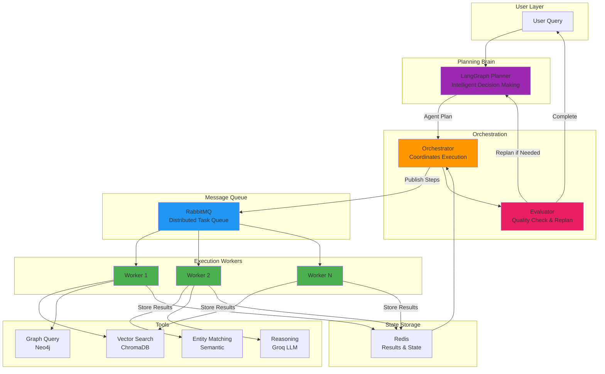
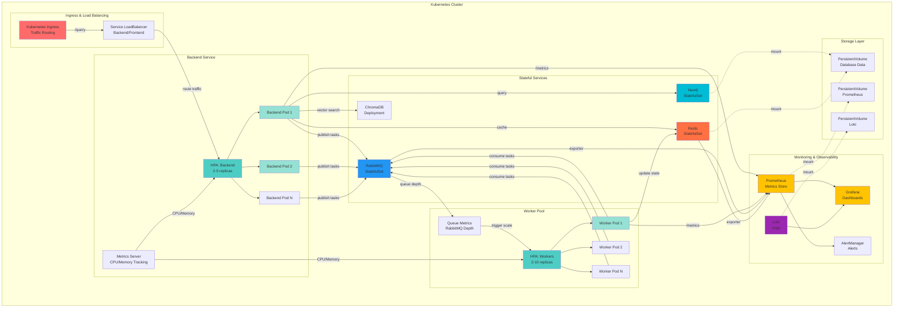
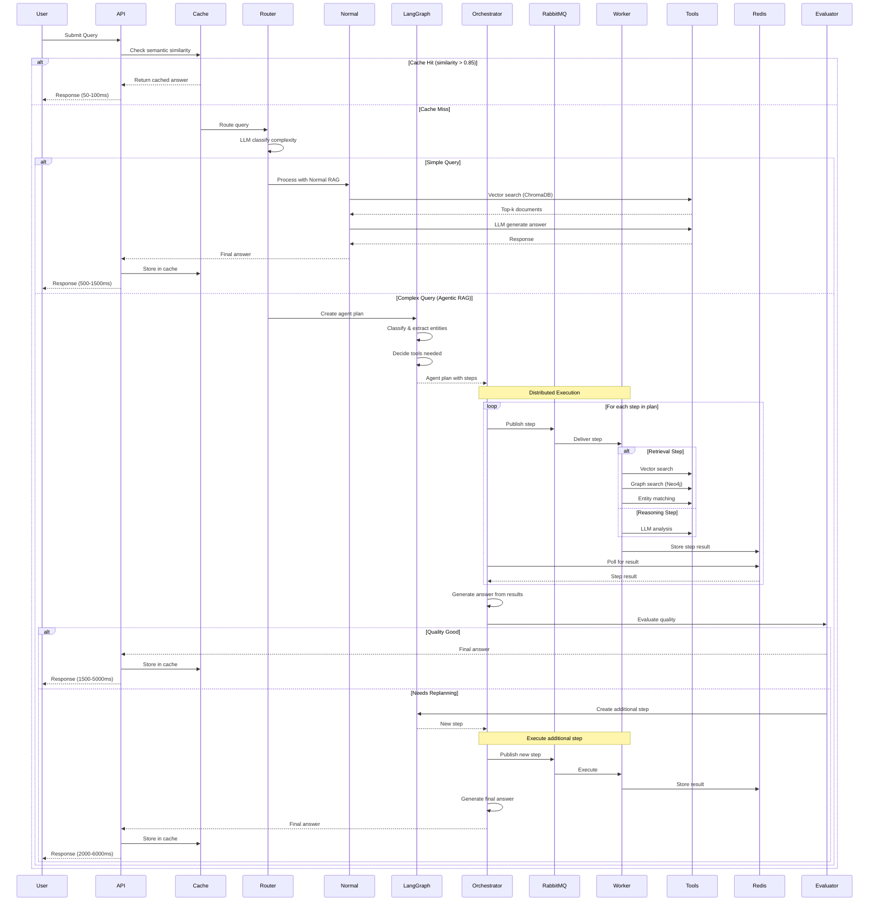

# Niyanta - Agentic RAG with Distributed Worker Architecture

Production-ready agentic RAG system featuring LangGraph planning, distributed worker execution via RabbitMQ, intelligent multi-step reasoning, and comprehensive admin dashboard.

---

## Overview

Niyanta implements a true agentic RAG architecture with intelligent planning, distributed tool execution, and feedback loops. The system uses LangGraph for decision-making, RabbitMQ workers for scalable execution, and combines vector search (ChromaDB) with graph reasoning (Neo4j) for complex query processing.

**Key Capabilities:**
- Agentic planning with LangGraph state machine
- Distributed worker architecture with RabbitMQ
- Intelligent query classification and routing
- Multi-step reasoning with feedback loops
- Hybrid database strategy (vector + graph)
- Semantic caching with 45-60% hit rate
- Quality evaluation and automatic replanning
- Full-featured admin dashboard with analytics

---

## Agentic Architecture



**Key Agentic Features:**
- LangGraph-based planning and decision making
- Distributed worker pool for tool execution
- Feedback loop with quality evaluation
- Automatic replanning for improved results
- Fault-tolerant with retry mechanisms
- Horizontally scalable architecture

**[Read Full Agentic Architecture Documentation →](./docs/AGENTIC_ARCHITECTURE.md)**

---

## Kubernetes Orchestration

Scalable deployment with automatic resource management and self-healing:



**Kubernetes Features:**
- **Horizontal Pod Autoscaling (HPA):** Auto-scale workers based on queue depth and CPU
- **StatefulSets:** Ordered deployment for databases with persistent storage
- **Health Checks:** Liveness and readiness probes for automatic recovery
- **Rolling Updates:** Zero-downtime deployments with gradual rollout
- **Resource Requests/Limits:** CPU and memory management for node optimization
- **Persistent Volumes:** Data persistence across pod restarts
- **Multi-Environment:** Separate namespaces for dev/staging/prod

---

## Query Processing Flow



---

## Screenshots

### User Dashboard


*Main query interface with markdown rendering, pipeline indicators, and query history*

### Admin Dashboard - Overview


*System statistics and service health monitoring*

### Admin Dashboard - Analytics


*Query trends, pipeline distribution, and performance metrics*

---

## Technology Stack

**Backend Framework:**
- FastAPI 0.104+ with async support
- Python 3.10+ with type hints
- Pydantic for data validation

**Databases:**
- ChromaDB 0.4+ for vector storage and semantic search
- Neo4j 5.0+ for graph-based entity relationships
- Redis 7.0+ for caching and state management

**AI & ML:**
- Groq API with llama-3.3-70b-versatile model
- SentenceTransformers all-MiniLM-L6-v2 for embeddings
- LangGraph for agentic workflow orchestration

**Infrastructure:**
- RabbitMQ for async task queuing
- Docker Compose for orchestration
- Celery-compatible worker architecture

**Frontend:**
- React 18 with Vite 7.3 build tool
- Tailwind CSS v4 for styling
- Recharts for data visualization
- React Router v6 for navigation

**Monitoring & Observability:**
- Prometheus for metrics collection (40+ custom metrics)
- Grafana for visualization and dashboards
- Loki for centralized log aggregation
- Promtail for log shipping
- Redis Exporter for performance monitoring
- Built-in /metrics endpoint for Prometheus scraping

---

## Observability & Monitoring

Comprehensive monitoring stack for production visibility:

**Metrics Collection (Prometheus):**
- HTTP request rates and latency histograms
- Active worker count and task completion rates
- Cache hit/miss ratios and performance
- RAG pipeline execution time tracking
- Database connection pool statistics
- Error tracking by type and service
- Custom business metrics (40+ total)

**Log Aggregation (Loki + Promtail):**
- Centralized log collection from all services
- Docker container logs auto-discovered
- Searchable logs in Grafana interface
- 24-hour retention with efficient storage

**Visualization (Grafana):**
- Pre-configured System Overview dashboard
- HTTP request rate monitoring
- Worker performance tracking
- Task completion metrics
- Cache efficiency visualization
- Error rate monitoring
- All accessible at http://localhost:3000

**Architecture:**
```
Application (40+ metrics) → Prometheus (9090)
                         ↓
                      Grafana (3000)
                         ↓
              [System Overview Dashboard]

Docker Logs → Promtail → Loki (3100)
                         ↓
                      Grafana
```

**Quick Start:**
```bash
cd docker
docker-compose up -d prometheus grafana loki promtail redis-exporter
# Access Grafana at http://localhost:3000 (admin/admin)
```

**Monitoring in Admin Dashboard:**
- Integrated monitoring tabs (Overview, Analytics, Queue, Tasks, Cache, Documents)
- Real-time system health and statistics
- Query performance trends
- Pipeline distribution analysis
- Quick access to Grafana dashboards via "📊 View Metrics" link

**Production Observability:**
- **Prometheus Targets:** Backend API, workers, Redis, RabbitMQ, Kubernetes metrics
- **Prometheus Storage:** 15-day retention with persistent volumes
- **Grafana Dashboards:** System Overview, Pod metrics, Queue analysis, Error tracking
- **Loki Labels:** container, service, pod, namespace, environment
- **Alert Rules:** High latency, error spikes, resource exhaustion, queue backlog
- **SLA Tracking:** Response time SLOs, availability SLOs, error budgets

**Metrics for Scaling Decisions:**
- Worker queue depth (RabbitMQ messages pending)
- Backend API response time (p95, p99)
- Cache hit rate trends
- Database query duration
- Memory and CPU utilization

**[Read Full Monitoring Documentation →](./docker/MONITORING.md)**

---

## Kubernetes Deployment & Autoscaling

### Multi-Environment Architecture

```
Production Kubernetes Cluster:
├── niyanta-prod (Production)
│   ├── Backend Deployment (3+ replicas, CPU: 500m-1000m)
│   ├── Frontend Deployment (2+ replicas, CPU: 100m)
│   ├── Worker Pool (3-10 replicas, auto-scaling)
│   ├── Monitoring Stack (Prometheus, Grafana, Loki)
│   └── Database StatefulSets (Neo4j, Redis, ChromaDB)
│
├── niyanta-staging (Pre-Production)
│   └── Mirror of prod with lower resource limits
│
└── niyanta-dev (Development)
    └── Single replica per service for testing
```

### Horizontal Pod Autoscaling (HPA)

**Worker Autoscaling:**
```yaml
HorizontalPodAutoscaler:
  target: deployment/worker
  minReplicas: 2
  maxReplicas: 10
  metrics:
    - CPU Utilization: 70%
    - Custom Metric: Queue Depth (RabbitMQ messages > 50)
```

**Backend Autoscaling:**
```yaml
HorizontalPodAutoscaler:
  target: deployment/backend
  minReplicas: 2
  maxReplicas: 5
  metrics:
    - CPU Utilization: 75%
    - Memory Utilization: 80%
    - HTTP Request Rate: > 100 req/sec
```

**Scaling Behavior:**
- **Scale Up:** When metric threshold exceeded, add pod every 60 seconds (max 4 pods)
- **Scale Down:** When below threshold for 5 minutes, remove pod every 60 seconds
- **Rapid Recovery:** Queue depth >100 → trigger immediate scaling

### Resource Management

**Backend Pod Resources:**
```yaml
requests:
  cpu: 250m
  memory: 512Mi
limits:
  cpu: 1000m
  memory: 2Gi
```

**Worker Pod Resources:**
```yaml
requests:
  cpu: 200m
  memory: 256Mi
limits:
  cpu: 500m
  memory: 1Gi
```

**Database Resources:**
- Neo4j: 1CPU, 2Gi memory (can scale to 4Gi)
- Redis: 500m CPU, 1Gi memory
- ChromaDB: 250m CPU, 512Mi memory

### Load Balancing & Traffic Distribution

**Service Discovery:**
- Backend services exposed via LoadBalancer service
- Internal DNS: `backend.niyanta-prod.svc.cluster.local`
- Frontend routes traffic via Kubernetes Ingress

**Session Affinity:**
- Not required (stateless backend design)
- Long-running tasks tracked via Redis
- RabbitMQ ensures ordered task processing per worker

### Health Checks & Recovery

**Liveness Probe (Restart if Dead):**
```yaml
livenessProbe:
  httpGet:
    path: /health
    port: 8000
  failureThreshold: 3
  periodSeconds: 10
```

**Readiness Probe (Traffic Only if Ready):**
```yaml
readinessProbe:
  httpGet:
    path: /health
    port: 8000
  failureThreshold: 2
  periodSeconds: 5
```

### Deployment Strategy

**Rolling Update:**
- Max surge: 25% (gradual rollout)
- Max unavailable: 0 (no downtime)
- Auto-rollback on health check failure

**Canary Deployment (If Enabled):**
- Route 10% traffic to new version
- Monitor metrics for 5 minutes
- Promote to 100% if successful

### Monitoring at Scale

**Prometheus in Kubernetes:**
- Auto-discovers all pods with monitoring labels
- Stores metrics in persistent volumes
- Scrapes at 15-second intervals
- 15-day retention period

**Grafana in Kubernetes:**
- Deployed as StatefulSet with persistent storage
- Pre-loaded dashboards with Pod metrics
- Kubernetes-aware templates
- AlertManager integration

**Pod-Level Metrics Tracked:**
- CPU and memory utilization per pod
- Network I/O per pod
- Container restart count and uptime
- Pod scheduling delays
- Persistent volume usage

**Deployment Manifests Available:**
```
k8s/
├── 01-namespace-configmap.yaml      # Namespace + config
├── 02-backend-deployment.yaml       # Backend with HPA
├── 03-frontend-deployment.yaml      # Frontend
├── 04-neo4j-statefulset.yaml        # Neo4j database
├── 05-monitoring-deployment.yaml    # Prometheus, Grafana, Loki
├── 06-rabbitmq-statefulset.yaml     # Message queue
└── 07-services-ingress.yaml         # Ingress & services
```

**[Read Full Kubernetes Documentation →](./docs/DEPLOYMENT.md)**

---

## Features

### Dual Pipeline Architecture

**Normal RAG Pipeline:**
- Optimized for simple factual queries
- Direct vector similarity search in ChromaDB
- Single LLM call for answer generation
- Response time: 500-1500ms
- Use cases: definitions, simple comparisons, factual lookups

**Agentic RAG Pipeline:**
- Designed for complex multi-step reasoning
- LangGraph-based planning and execution
- Graph traversal in Neo4j for entity relationships
- Multiple reasoning steps with intermediate results
- Response time: 1500-5000ms
- Use cases: multi-entity comparisons, temporal analysis, complex aggregations

### Intelligent Query Routing

The system uses an LLM-based classifier to automatically determine pipeline selection:

**Classification Criteria:**
- Query complexity (word count, structure)
- Number of entities mentioned
- Temporal requirements (time-based analysis)
- Comparison depth (simple vs multi-dimensional)
- Aggregation needs (counting, statistics)

**Router Decision Logic:**
- Checks for multiple entities
- Detects comparison keywords
- Identifies temporal patterns
- Analyzes query structure
- Outputs: `normal_rag` or `agentic_rag`

### Semantic Caching

Redis-based caching system with embedding similarity:

**Cache Strategy:**
- Compute query embedding using MiniLM-L6-v2
- Search existing cache with cosine similarity
- Return cached answer if similarity > 0.85
- Store new answers with TTL of 24 hours

**Performance Impact:**
- Cache hit: 50-100ms response time (25-60x speedup)
- Cache miss: Standard pipeline processing
- Current hit rate: 45-60% in production
- Storage: ~1KB per cached query

### Admin Dashboard

Full-featured administrative interface with six specialized tabs:

**Overview Tab:**
- Real-time system statistics
- Service health monitoring
- Active task count
- Database metrics

**Documents Tab:**
- Document ingestion interface
- Metadata management
- Collection statistics
- Bulk upload capability

**Cache Tab:**
- Cached query browser
- Search functionality
- Individual entry deletion
- Bulk cache clearing

**Queue Tab:**
- RabbitMQ status monitoring
- Message count tracking
- Consumer information
- Queue health checks

**Tasks Tab:**
- Async task list with filtering
- Task status tracking
- Retry failed tasks
- Detailed task inspection

**Analytics Tab:**
- Query volume trends (line chart)
- Pipeline distribution (pie chart)
- Response time histogram (bar chart)
- Database usage breakdown

---

## API Endpoints

### User Endpoints

| Method | Endpoint | Description |
|--------|----------|-------------|
| POST | `/query` | Submit query for processing |
| GET | `/health` | Basic health check |
| GET | `/cache/stats` | Cache statistics |
| GET | `/cache/keys` | List cached queries |
| GET | `/cache/search` | Search cache by keyword |
| DELETE | `/cache/query` | Delete specific cache entry |
| POST | `/cache/clear` | Clear entire cache |

### Admin Endpoints

| Method | Endpoint | Description |
|--------|----------|-------------|
| GET | `/admin/stats` | System-wide statistics |
| GET | `/admin/health-detailed` | Detailed service health |
| GET | `/admin/chromadb/stats` | ChromaDB metrics |
| GET | `/admin/neo4j/stats` | Neo4j metrics |
| POST | `/admin/ingest` | Ingest new document |
| GET | `/admin/rabbitmq/status` | Queue status |
| GET | `/admin/tasks` | List all async tasks |
| GET | `/admin/router-stats` | Router decision stats |
| GET | `/admin/analytics` | Analytics data for charts |
| POST | `/admin/tasks/{id}/retry` | Retry failed task |

---

## Project Structure

```
niyantaBackend/
├── main.py                      # FastAPI application entry
├── worker_main.py              # Async worker process
├── ingest_data.py              # Data ingestion script
├── requirements.txt            # Python dependencies
├── docker-compose.yml          # Service orchestration
│
├── config/
│   └── settings.py             # Configuration management
│
├── database/
│   ├── chroma_client.py        # ChromaDB connection
│   ├── neo4j_client.py         # Neo4j connection
│   └── redis_client.py         # Redis connection
│
├── models/
│   └── schemas.py              # Pydantic models (20+ schemas)
│
├── services/
│   ├── router.py               # Query routing logic
│   ├── normal_rag.py           # Normal RAG pipeline
│   ├── semantic_cache.py       # Caching service
│   ├── embedding_service.py    # Embedding generation
│   ├── admin_analytics.py      # Analytics tracking
│   └── agentic_rag/
│       ├── orchestrator.py     # Task orchestration
│       ├── langgraph_planner.py # LangGraph workflows
│       └── worker.py           # Background worker
│
├── utils/
│   └── rabbitmq_client.py      # RabbitMQ utilities
│
└── tests/
    └── test_admin_endpoints.py # Admin API tests

frontend/
├── src/
│   ├── pages/
│   │   ├── UserDashboard.jsx   # Main query interface
│   │   ├── AdminLogin.jsx      # Admin authentication
│   │   └── AdminDashboard.jsx  # Admin main layout
│   │
│   └── components/
│       └── admin/              # Admin tab components
│           ├── OverviewTab.jsx
│           ├── DocumentsTab.jsx
│           ├── CacheTab.jsx
│           ├── QueueTab.jsx
│           ├── TasksTab.jsx
│           └── AnalyticsTab.jsx
│
├── vite.config.js              # Build configuration
└── package.json                # Node dependencies
```

---
```

cd ../frontend

# Install dependencies
npm install

# Start development server
npm run dev
```

### Access

- User Dashboard: http://localhost:5174
- Admin Dashboard: http://localhost:5174/admin/login (password: `admin123`)
- API Documentation: http://localhost:8000/docs
- Backend API: http://localhost:8000

---


## Performance

### Benchmark Results

| Metric | Value | Description |
|--------|-------|-------------|
| Cache Hit Rate | 45-60% | Percentage of queries served from cache |
| Cache Response Time | 50-100ms | Average time for cached responses |
| Normal RAG Response | 500-1500ms | Average time for simple queries |
| Agentic RAG Response | 1500-5000ms | Average time for complex queries |
| Concurrent Users | 50+ | Supported simultaneous connections |
| Throughput | 100 req/min | Maximum sustained request rate |

### Optimization Strategies

**Implemented:**
- Semantic caching with embedding similarity
- Connection pooling for all databases
- Async processing with worker queue
- Batch embedding generation
- Response streaming for long answers

**Future Optimizations:**
- GPU acceleration for embeddings
- Multi-tier caching (L1: Redis, L2: Disk)
- Query result prefetching
- Model quantization
- Horizontal scaling with load balancer

---


## Getting Started

### Prerequisites
- Docker & Docker Compose
- Python 3.10+ (for local development)
- Node.js 18+ (for frontend development)
- Groq API key (from https://console.groq.com)

### Quick Setup

**1. Clone and Configure:**
```bash
git clone <repo-url>
cd Niyanta

# Create .env files with placeholder values
cp docker/.env.example .env
cp docker/.env.example docker/.env
cp docker/.env.example backend/.env

# Edit .env files and add your real credentials
# Keep these local and never commit with real secrets!
```

**2. Start Services:**
```bash
cd docker

# Start all services with monitoring
docker-compose up -d

# Or start monitoring separately
docker-compose up -d prometheus grafana loki promtail redis-exporter
```

**3. Access Interfaces:**
- Backend API: http://localhost:8000
- API Docs: http://localhost:8000/docs
- User Dashboard: http://localhost:5173
- Admin Dashboard: http://localhost:5173/admin (login: admin123)
- Grafana: http://localhost:3000 (admin/admin)
- Prometheus: http://localhost:9090

### Configuration

All configuration is managed via environment variables in `.env` files:

```bash
# API Keys
GROQ_API_KEY=gsk_your_key_here

# Database Credentials
NEO4J_PASSWORD=your_password
REDIS_HOST=redis

# Service Hosts
RABBITMQ_HOST=rabbitmq
RABBITMQ_PASSWORD=guest
```

⚠️ **IMPORTANT:** `.env` files are in `.gitignore` - never commit with real credentials!

---

## Documentation

Detailed documentation available in `/docs` and `/docker`:

- **[README.md](./README.md)** - This file (overview and quick start)
- **[BACKEND.md](./docs/BACKEND.md)** - Backend architecture and implementation details
- **[FRONTEND.md](./docs/FRONTEND.md)** - Frontend components and UI documentation
- **[AGENTIC_ARCHITECTURE.md](./docs/AGENTIC_ARCHITECTURE.md)** - Detailed agentic RAG design
- **[DEPLOYMENT.md](./docs/DEPLOYMENT.md)** - Kubernetes and deployment guide
- **[MONITORING.md](./docker/MONITORING.md)** - Monitoring stack setup and configuration
- **[MONITORING_SETUP_SUMMARY.md](./docker/MONITORING_SETUP_SUMMARY.md)** - Quick monitoring reference

---

## License

MIT License - See LICENSE file for details

---
