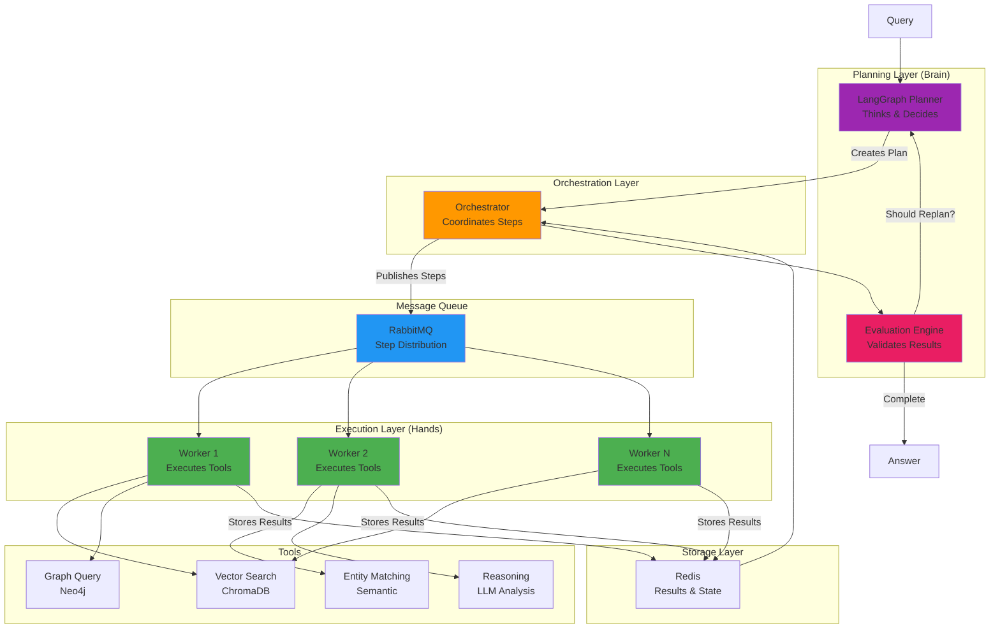
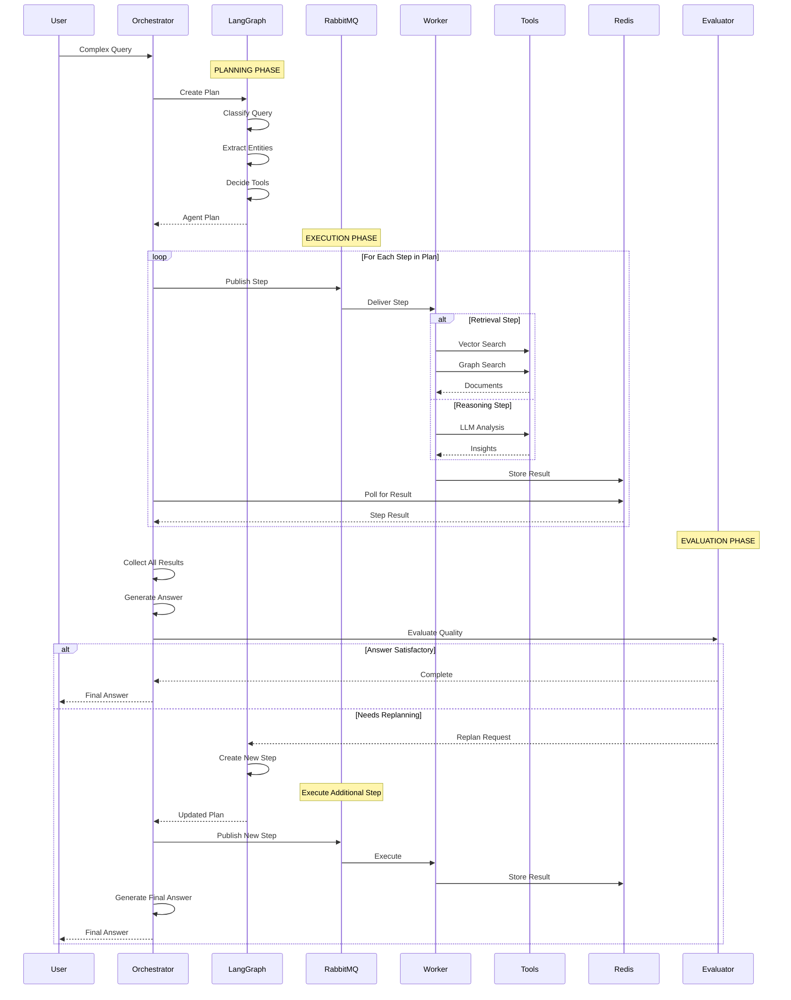
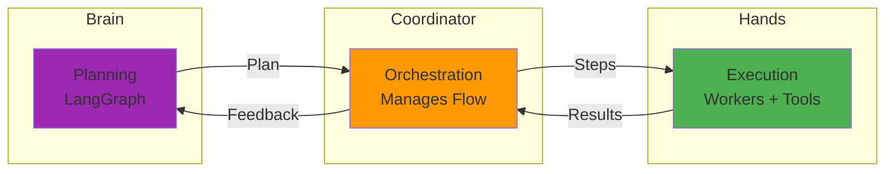
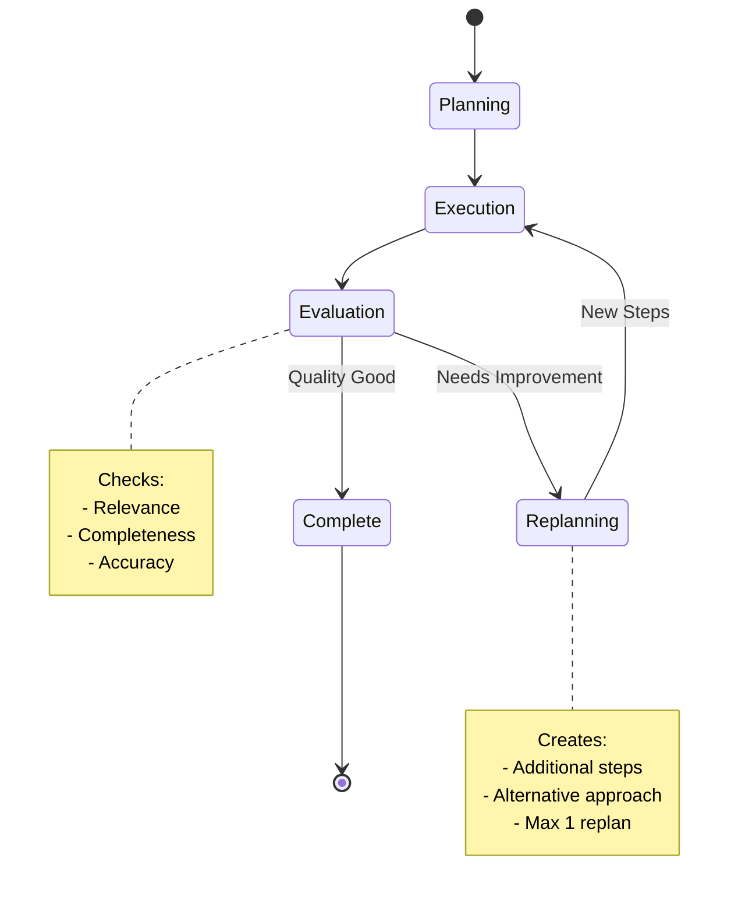
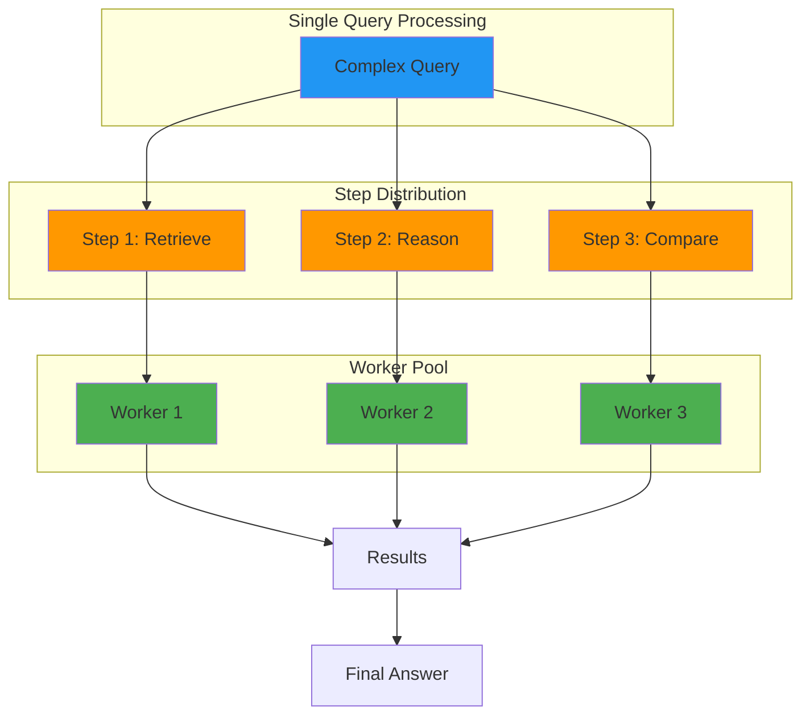
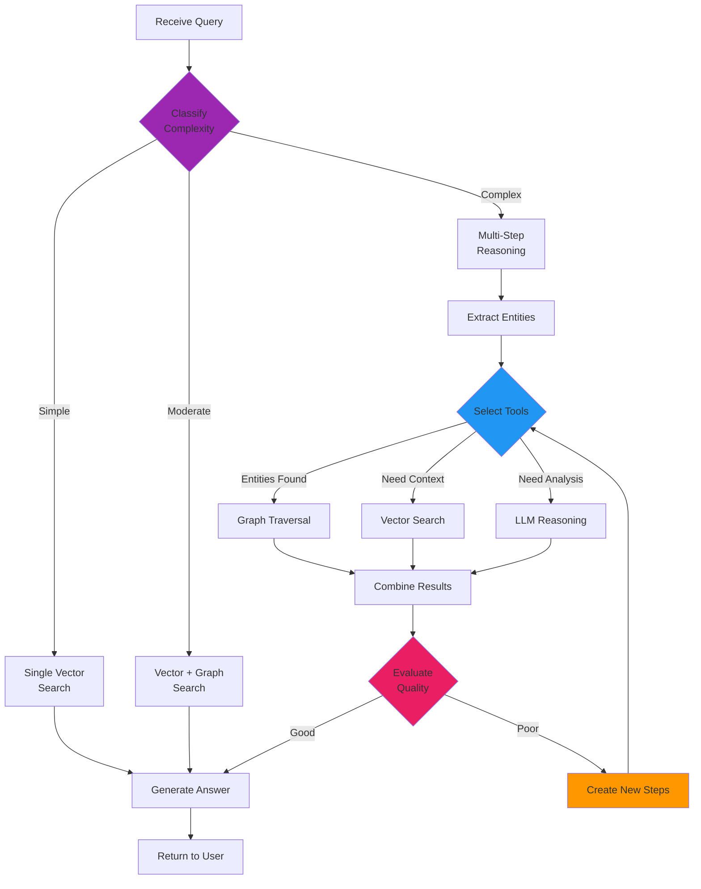
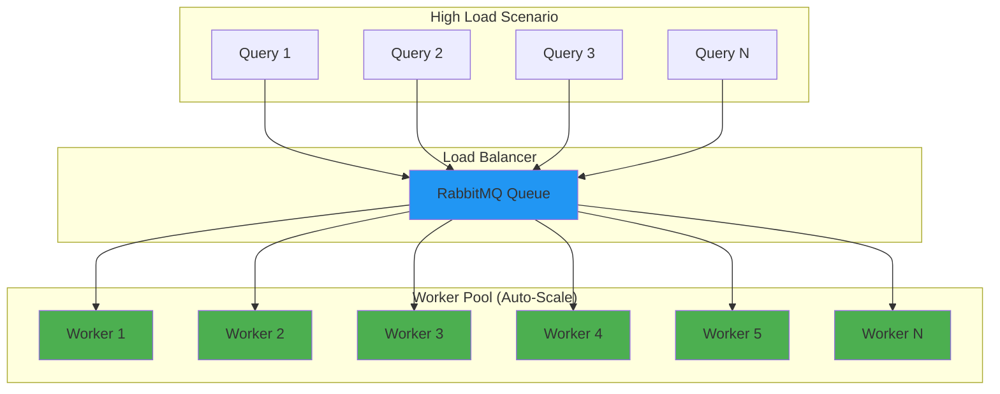
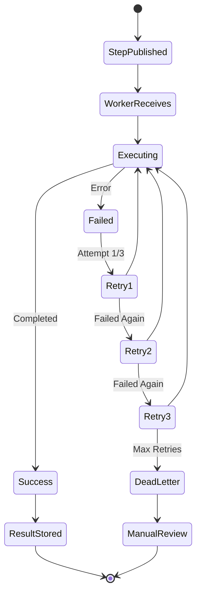

# Agentic RAG Architecture - How It Works

## Overview

This system implements a **true agentic RAG architecture** using a distributed worker pattern. Unlike traditional RAG systems that follow a fixed pipeline, this architecture uses an intelligent agent that can plan, execute tools, evaluate results, and replan if needed.

---

## Architecture Pattern



---

## Complete Agentic Flow



---

## Key Agentic Features

### 1. Separation of Concerns (Agent Design Pattern)



**Why This Matters:**
- **Brain (LangGraph)** thinks and decides what to do
- **Coordinator (Orchestrator)** manages the workflow
- **Hands (Workers)** execute the actual tools
- Each component can be scaled independently

### 2. Tool Execution Framework

The worker implements multiple tools that the agent can use:

```python
# Tools Available to Agent
TOOL_CATALOG = {
    "vector_search": {
        "description": "Search document database",
        "execution": worker._execute_retrieval(mode="vector")
    },
    "graph_query": {
        "description": "Query knowledge graph",
        "execution": worker._execute_retrieval(mode="graph")
    },
    "entity_matching": {
        "description": "Find entities semantically",
        "execution": entity_matcher.find_matching_entities()
    },
    "reasoning": {
        "description": "Analyze with LLM",
        "execution": worker._execute_reasoning()
    }
}
```

### 3. Feedback Loop with Replanning



**Evaluation Criteria:**
```python
class AnswerEvaluation:
    is_relevant: bool       # Answers the query?
    is_complete: bool       # All aspects covered?
    has_evidence: bool      # Based on retrieved docs?
    confidence_score: float # 0.0 to 1.0
    should_replan: bool     # Need more steps?
```

### 4. Distributed Execution



**Benefits:**
- Parallel step execution (if independent)
- Fault tolerance (retry failed steps)
- Horizontal scaling (add more workers)
- Graceful degradation

---

## Why This is Truly Agentic

### Comparison: Traditional RAG vs Agentic RAG

| Feature | Traditional RAG | This Agentic System |
|---------|----------------|---------------------|
| **Planning** | Fixed pipeline | LLM-based dynamic planning |
| **Tool Use** | Hardcoded sequence | Selects tools based on query |
| **Feedback** | None | Evaluates and replans |
| **Execution** | Synchronous | Async distributed workers |
| **Adaptability** | Static | Adapts to complexity |
| **Error Handling** | Fails or returns error | Retries, replans, recovers |
| **Multi-Step** | Single retrieval | Multiple coordinated steps |

### Agent Decision-Making Process



---

## Implementation Details

### 1. LangGraph State Machine

```python
# Agent state flows through nodes
class AgentState(TypedDict):
    request_id: str
    original_query: str
    classification: str          # simple/moderate/complex
    entities: list[str]          # extracted entities
    retrieval_mode: str          # vector/graph/hybrid
    steps_completed: int         # progress tracking
    should_stop: bool            # completion flag
    replan_count: int            # replanning attempts
```

**Graph Nodes:**
- `classify_query` - Determine complexity
- `extract_entities` - Find key concepts
- `decide_retrieval` - Choose tools
- `plan_next_step` - Create step
- `check_stop_or_continue` - Evaluate progress
- `decide_replan` - Replan if needed

### 2. Worker Tool Execution

```python
# Worker processes steps from queue
async def _process_step(self, step: AgentStep):
    if step.step_type == StepType.RETRIEVE:
        # Execute vector + graph search
        documents = await self._execute_retrieval(step)
    
    elif step.step_type == StepType.REASON:
        # Execute LLM reasoning
        analysis = await self._execute_reasoning(step)
    
    # Store result in Redis for orchestrator
    await redis_client.set_json(f"step_result:{step.id}", result)
```

**Tools Implemented:**
1. **Vector Search** - Semantic similarity in ChromaDB
2. **Graph Search** - Entity relationships in Neo4j
3. **Entity Matching** - Semantic entity resolution
4. **LLM Reasoning** - Complex analysis with Groq

### 3. Orchestrator Coordination

```python
# Orchestrator manages agent lifecycle
async def process_query(query: str):
    # 1. Planning
    plan = await langgraph_planner.create_plan(query)
    
    # 2. Execution
    results = await self._execute_plan_steps(plan)
    
    # 3. Answer Generation
    answer = await self._generate_answer(query, results)
    
    # 4. Evaluation
    evaluation = await self._evaluate_answer(query, answer)
    
    # 5. Replan if needed (max 1 time)
    if evaluation.should_replan:
        new_results = await self._execute_replan_step(plan)
        answer = await self._generate_answer(query, new_results)
    
    return answer
```

---

## Scalability & Fault Tolerance

### Horizontal Scaling



**Scaling Strategy:**
- Add more worker processes during peak load
- Workers pull from shared RabbitMQ queue
- No coordination needed between workers
- Each worker is stateless

### Fault Tolerance



**Error Handling:**
- Automatic retry (max 3 attempts)
- Exponential backoff between retries
- Dead letter queue for failed steps
- Graceful degradation (partial results)

---

## Production Features

### 1. Observability

**Tracking Points:**
- LangGraph decisions logged
- Each step execution tracked
- Results stored with metadata
- End-to-end tracing with request_id

**Metrics Collected:**
```python
{
    "request_id": "abc-123",
    "classification": "complex",
    "entities_extracted": 3,
    "tools_used": ["vector_search", "graph_query", "reasoning"],
    "steps_executed": 3,
    "replanned": True,
    "total_time_ms": 3200,
    "worker_time_ms": 2100,
    "planning_time_ms": 400
}
```

### 2. Resource Management

**Timeouts:**
- Planning: 5 seconds max
- Step execution: 30 seconds max
- Total query: 120 seconds max

**Bounded Execution:**
- Max 5 steps per query
- Max 1 replan attempt
- Max 3 retries per step

### 3. State Persistence

**Redis Storage:**
```
step_result:{step_id} → StepResult (TTL: 10 min)
task_status:{request_id} → TaskStatus (TTL: 1 hour)
agent_plan:{request_id} → AgentPlan (TTL: 1 hour)
```

---

## Comparison to Other Agentic Patterns

### LangChain ReAct Agent

**Standard Pattern:**
```
Question → Thought → Action → Observation → Thought → ... → Answer
```

**This System:**
```
Query → Plan → Distribute Steps → Execute in Parallel → Evaluate → Answer
```

**Advantage:** Parallel execution, better for complex queries

### AutoGPT Pattern

**AutoGPT:**
- Sequential execution
- Many LLM calls
- Can loop indefinitely

**This System:**
- Bounded execution (max steps)
- Efficient LLM usage
- Distributed processing

---

## Future Enhancements

**To make it even more agentic:**

1. **Dynamic Tool Discovery**
   - Agent discovers available tools
   - Tools register themselves
   - Runtime tool composition

2. **Multi-Round Conversation**
   - Memory across queries
   - Context accumulation
   - Clarification questions

3. **Meta-Reasoning**
   - Agent reflects on strategy
   - Learns from failures
   - Optimizes tool selection

4. **Advanced Evaluation**
   - Multi-dimensional scoring
   - Contradiction detection
   - Source citation validation

---

## Conclusion

This system implements a **production-grade agentic RAG architecture** with:

✅ Intelligent planning (LangGraph)
✅ Distributed execution (RabbitMQ workers)
✅ Tool abstraction (worker implements tools)
✅ Feedback loops (evaluation + replanning)
✅ Fault tolerance (retries, graceful degradation)
✅ Horizontal scaling (add more workers)
✅ Observability (comprehensive tracking)

**It's truly agentic because:**
- Agent decides what to do (not hardcoded)
- Executes tools dynamically
- Evaluates its own output
- Can replan and improve
- Adapts to query complexity

This architecture pattern is suitable for production use cases requiring complex, multi-step reasoning with high reliability and scalability.
