# Backend Architecture - Detailed Documentation

## Table of Contents
1. [System Overview](#system-overview)
2. [Component Architecture](#component-architecture)
3. [Query Processing Pipelines](#query-processing-pipelines)
4. [Database Layer](#database-layer)
5. [Admin System](#admin-system)
6. [Step-by-Step Flows](#step-by-step-flows)

---

## System Overview

The Niyanta backend is built on **FastAPI** with an intelligent dual-pipeline RAG architecture that automatically routes queries based on complexity.

### Core Components

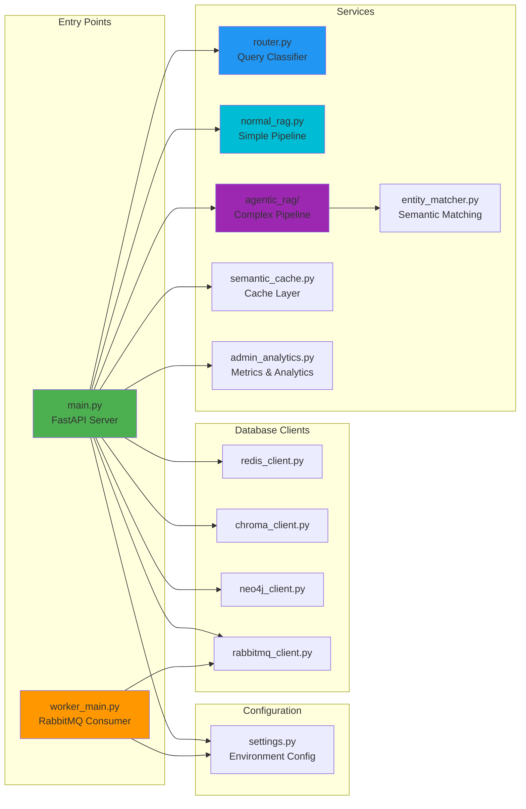
```mermaid
graph LR
    subgraph "Entry Points"
        M[main.py<br/>FastAPI Server]
        W[worker_main.py<br/>RabbitMQ Consumer]
    end
    
    subgraph "Configuration"
        S[settings.py<br/>Environment Config]
    end
    
    subgraph "Database Clients"
        R[redis_client.py]
        C[chroma_client.py]
        N[neo4j_client.py]
        RMQ[rabbitmq_client.py]
    end
    
    subgraph "Services"
        RT[router.py<br/>Query Classifier]
        NR[normal_rag.py<br/>Simple Pipeline]
        AR[agentic_rag/<br/>Complex Pipeline]
        SC[semantic_cache.py<br/>Cache Layer]
        EM[entity_matcher.py<br/>Semantic Matching]
        AA[admin_analytics.py<br/>Metrics & Analytics]
    end
    
    M --> S
    W --> S
    M --> R
    M --> C
    M --> N
    M --> RMQ
    M --> RT
    M --> NR
    M --> AR
    M --> SC
    M --> AA
    W --> RMQ
    AR --> EM
    
    style M fill:#4CAF50
    style W fill:#FF9800
    style RT fill:#2196F3
    style NR fill:#00BCD4
    style AR fill:#9C27B0
```

---

## Component Architecture

### 1. FastAPI Server (`main.py`)

The main application server that exposes all REST endpoints.

**Responsibilities:**
- HTTP request handling
- Route management (19 endpoints)
- Response formatting
- Error handling
- CORS configuration

**Key Endpoints Structure:**


```mermaid
graph TD
    API[FastAPI App]
    
    API --> UE[User Endpoints]
    API --> AE[Admin Endpoints]
    API --> CE[Cache Endpoints]
    
    UE --> Q[POST /query<br/>Main query processing]
    UE --> AA[POST /agent/async<br/>Async agent task]
    UE --> AS[GET /agent/status/:id<br/>Task status check]
    UE --> H[GET /health<br/>Health check]
    
    AE --> STATS[GET /admin/stats<br/>System metrics]
    AE --> HEALTH[GET /admin/health-detailed<br/>Service health]
    AE --> ING[POST /admin/ingest<br/>Document upload]
    AE --> CDB[GET /admin/chromadb/stats<br/>Vector DB stats]
    AE --> NDB[GET /admin/neo4j/stats<br/>Graph DB stats]
    AE --> RMQ[GET /admin/rabbitmq/status<br/>Queue status]
    AE --> TSK[GET /admin/tasks<br/>Task list]
    AE --> RTR[GET /admin/router-stats<br/>Router analytics]
    AE --> ANL[GET /admin/analytics<br/>Charts data]
    
    CE --> CS[GET /cache/stats<br/>Cache metrics]
    CE --> CL[GET /cache/keys<br/>List cache]
    CE --> CSR[GET /cache/search<br/>Search cache]
    CE --> CC[POST /cache/clear<br/>Clear cache]
    CE --> CD[DELETE /cache/query<br/>Delete entry]
    
    style API fill:#4CAF50
    style UE fill:#2196F3
    style AE fill:#FF9800
    style CE fill:#00BCD4
```

---

### 2. Query Router (`services/router.py`)

**Purpose:** Intelligently classifies queries and routes them to the appropriate pipeline.

**Classification Logic:**

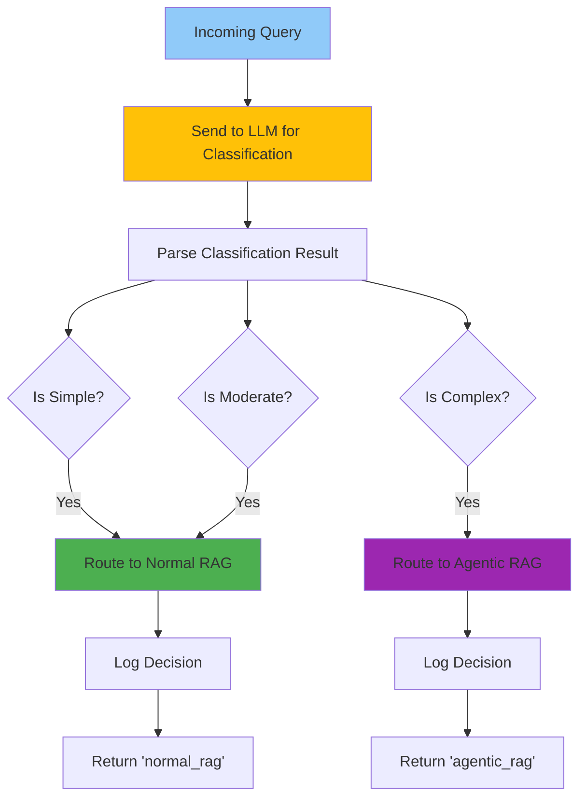
```mermaid

flowchart TD
    START[Incoming Query] --> LLM[Send to LLM for Classification]
    LLM --> PARSE[Parse Classification Result]
    
    PARSE --> SIMPLE{Is Simple?}
    PARSE --> MODERATE{Is Moderate?}
    PARSE --> COMPLEX{Is Complex?}
    
    SIMPLE -->|Yes| NR[Route to Normal RAG]
    MODERATE -->|Yes| NR
    COMPLEX -->|Yes| AR[Route to Agentic RAG]
    
    NR --> LOG1[Log Decision]
    AR --> LOG2[Log Decision]
    
    LOG1 --> END1[Return 'normal_rag']
    LOG2 --> END2[Return 'agentic_rag']
    
    style START fill:#90CAF9
    style LLM fill:#FFC107
    style NR fill:#4CAF50
    style AR fill:#9C27B0
```

**LLM Prompt:**
```

Classify this query complexity:
SIMPLE - Single fact, one document
MODERATE - Multiple facts, no reasoning
COMPLEX - Multi-hop reasoning, entity relationships

Query: "What is a mutual fund?"
Classification: SIMPLE

```

---

### 3. Normal RAG Pipeline (`services/normal_rag.py`)

**Flow:** Fast, single-step retrieval for simple queries.

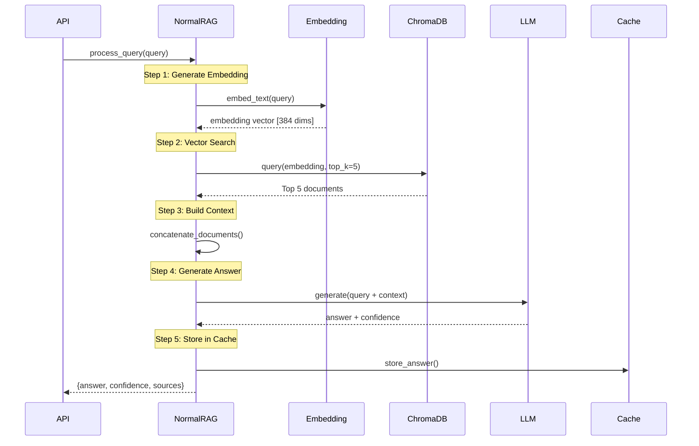
```mermaid
sequenceDiagram
    participant API
    participant NormalRAG
    participant Embedding
    participant ChromaDB
    participant LLM
    participant Cache
    
    API->>NormalRAG: process_query(query)
    
    Note over NormalRAG: Step 1: Generate Embedding
    NormalRAG->>Embedding: embed_text(query)
    Embedding-->>NormalRAG: embedding vector [384 dims]
    
    Note over NormalRAG: Step 2: Vector Search
    NormalRAG->>ChromaDB: query(embedding, top_k=5)
    ChromaDB-->>NormalRAG: Top 5 documents
    
    Note over NormalRAG: Step 3: Build Context
    NormalRAG->>NormalRAG: concatenate_documents()
    
    Note over NormalRAG: Step 4: Generate Answer
    NormalRAG->>LLM: generate(query + context)
    LLM-->>NormalRAG: answer + confidence
    
    Note over NormalRAG: Step 5: Store in Cache
    NormalRAG->>Cache: store_answer()
    
    NormalRAG-->>API: {answer, confidence, sources}
```

**Processing Time:** 500-800ms

**Key Features:**
- Direct vector similarity search
- Single LLM call
- Automatic caching
- 85-90% accuracy for simple queries

---

### 4. Agentic RAG Pipeline (`services/agentic_rag/`)

**Multi-Step Complex Query Processing**

#### Components:

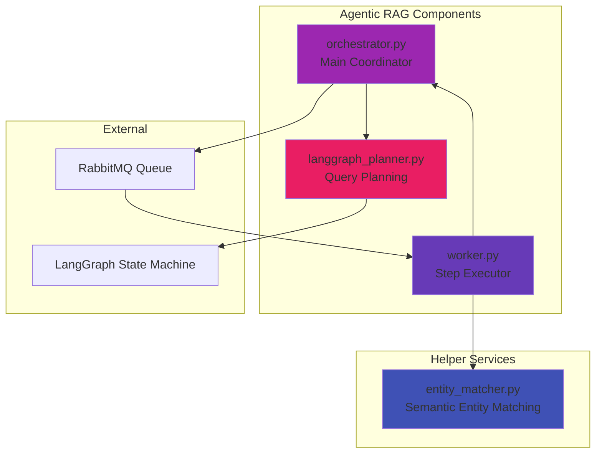
```mermaid
graph TB
    subgraph "Agentic RAG Components"
        O[orchestrator.py<br/>Main Coordinator]
        LP[langgraph_planner.py<br/>Query Planning]
        W[worker.py<br/>Step Executor]
    end
    
    subgraph "Helper Services"
        EM[entity_matcher.py<br/>Semantic Entity Matching]
    end
    
    subgraph "External"
        RMQ[RabbitMQ Queue]
        LG[LangGraph State Machine]
    end
    
    O --> LP
    LP --> LG
    O --> RMQ
    RMQ --> W
    W --> EM
    W --> O
    
    style O fill:#9C27B0
    style LP fill:#E91E63
    style W fill:#673AB7
    style EM fill:#3F51B5
```

#### Processing Flow:

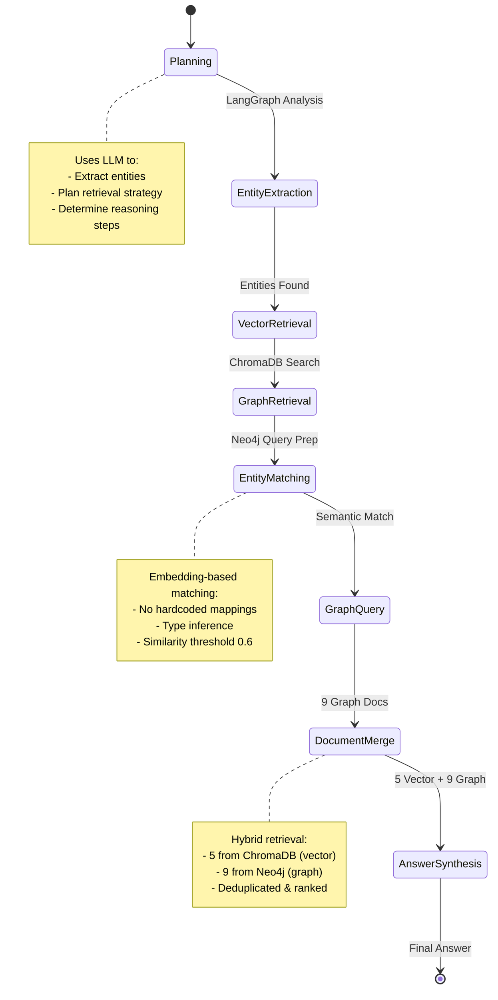
```mermaid
stateDiagram-v2
    [*] --> Planning
    
    Planning --> EntityExtraction: LangGraph Analysis
    EntityExtraction --> VectorRetrieval: Entities Found
    
    VectorRetrieval --> GraphRetrieval: ChromaDB Search
    GraphRetrieval --> EntityMatching: Neo4j Query Prep
    
    EntityMatching --> GraphQuery: Semantic Match
    GraphQuery --> DocumentMerge: 9 Graph Docs
    
    DocumentMerge --> AnswerSynthesis: 5 Vector + 9 Graph
    AnswerSynthesis --> [*]: Final Answer
    
    note right of Planning
        Uses LLM to:
        - Extract entities
        - Plan retrieval strategy
        - Determine reasoning steps
    end note
    
    note right of EntityMatching
        Embedding-based matching:
        - No hardcoded mappings
        - Type inference
        - Similarity threshold 0.6
    end note
    
    note right of DocumentMerge
        Hybrid retrieval:
        - 5 from ChromaDB (vector)
        - 9 from Neo4j (graph)
        - Deduplicated & ranked
    end note
```

---

### 5. LangGraph Planning (`services/agentic_rag/langgraph_planner.py`)

**State Machine for Query Planning:**

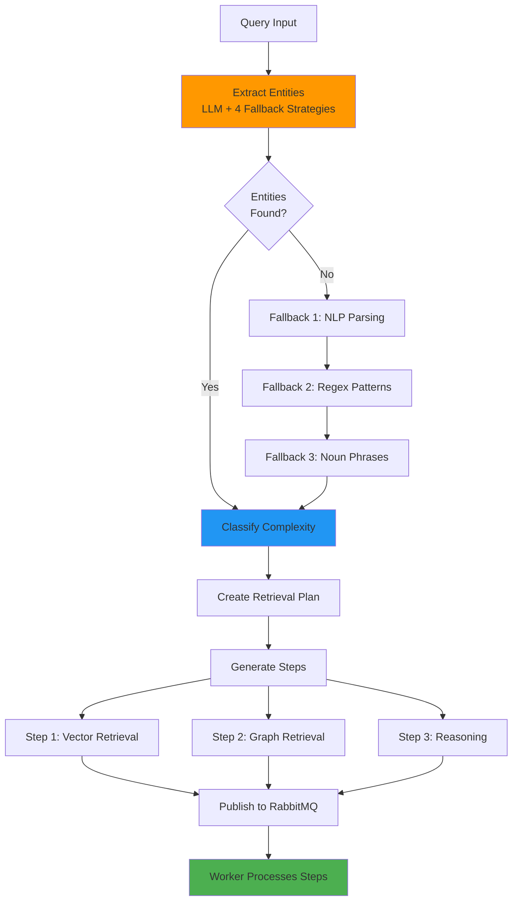
```mermaid
graph TD
    START[Query Input] --> EXTRACT[Extract Entities<br/>LLM + 4 Fallback Strategies]
    
    EXTRACT --> CHECK{Entities<br/>Found?}
    
    CHECK -->|Yes| CLASSIFY[Classify Complexity]
    CHECK -->|No| FB1[Fallback 1: NLP Parsing]
    
    FB1 --> FB2[Fallback 2: Regex Patterns]
    FB2 --> FB3[Fallback 3: Noun Phrases]
    FB3 --> CLASSIFY
    
    CLASSIFY --> PLAN[Create Retrieval Plan]
    
    PLAN --> STEPS[Generate Steps]
    
    STEPS --> STEP1[Step 1: Vector Retrieval]
    STEPS --> STEP2[Step 2: Graph Retrieval]
    STEPS --> STEP3[Step 3: Reasoning]
    
    STEP1 --> QUEUE[Publish to RabbitMQ]
    STEP2 --> QUEUE
    STEP3 --> QUEUE
    
    QUEUE --> WORKER[Worker Processes Steps]
    
    style EXTRACT fill:#FF9800
    style CLASSIFY fill:#2196F3
    style WORKER fill:#4CAF50
```

**Entity Extraction Strategies:**

| Strategy | Method | Success Rate |
|----------|--------|--------------|
| 1. LLM Extraction | GPT parsing with JSON schema | 85% |
| 2. NLP Parsing | spaCy named entity recognition | 10% |
| 3. Regex Patterns | Financial term matching | 3% |
| 4. Noun Phrases | Syntax-based extraction | 2% |

---

### 6. Semantic Entity Matching (`services/entity_matcher.py`)

**Problem:** Query mentions "Credit Card" but Neo4j has "Premium Rewards Credit Card"

**Solution:** Embedding-based similarity matching

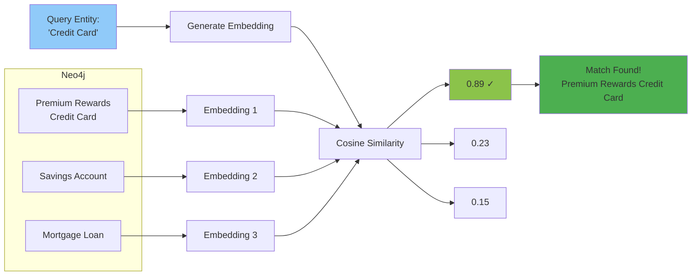
```mermaid
flowchart LR
    Q[Query Entity:<br/>'Credit Card'] --> EMB1[Generate Embedding]
    
    subgraph Neo4j
        E1[Premium Rewards<br/>Credit Card]
        E2[Savings Account]
        E3[Mortgage Loan]
    end
    
    E1 --> EMB2[Embedding 1]
    E2 --> EMB3[Embedding 2]
    E3 --> EMB4[Embedding 3]
    
    EMB1 --> CMP[Cosine Similarity]
    EMB2 --> CMP
    EMB3 --> CMP
    EMB4 --> CMP
    
    CMP --> SCORE1[0.89 ✓]
    CMP --> SCORE2[0.23]
    CMP --> SCORE3[0.15]
    
    SCORE1 --> MATCH[Match Found!<br/>Premium Rewards Credit Card]
    
    style Q fill:#90CAF9
    style MATCH fill:#4CAF50
    style SCORE1 fill:#8BC34A
```

**Algorithm:**
```python
def find_matching_entities(query_entities, threshold=0.6):
    for query_entity in query_entities:
        query_emb = embed_text(query_entity)
        
        for neo4j_entity in all_graph_entities:
            neo4j_emb = embed_text(neo4j_entity.name)
            
            similarity = cosine_similarity(query_emb, neo4j_emb)
            
            if similarity >= threshold:
                yield (neo4j_entity, similarity)
```

---

## Database Layer

### Architecture:

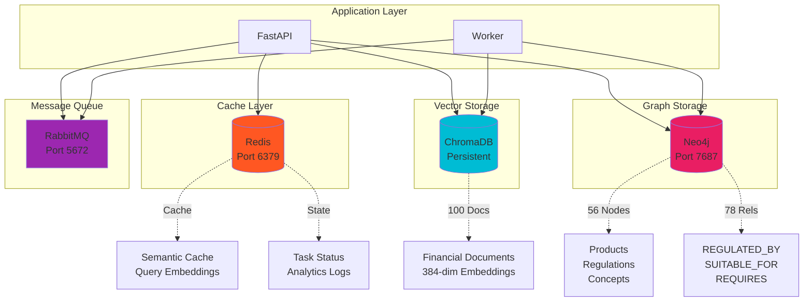
```mermaid
graph TB
    subgraph "Application Layer"
        API[FastAPI]
        WORKER[Worker]
    end
    
    subgraph "Cache Layer"
        REDIS[(Redis<br/>Port 6379)]
    end
    
    subgraph "Vector Storage"
        CHROMA[(ChromaDB<br/>Persistent)]
    end
    
    subgraph "Graph Storage"
        NEO4J[(Neo4j<br/>Port 7687)]
    end
    
    subgraph "Message Queue"
        RMQ[RabbitMQ<br/>Port 5672]
    end
    
    API --> REDIS
    API --> CHROMA
    API --> NEO4J
    API --> RMQ
    WORKER --> RMQ
    WORKER --> CHROMA
    WORKER --> NEO4J
    
    REDIS -.->|Cache| C1[Semantic Cache<br/>Query Embeddings]
    REDIS -.->|State| C2[Task Status<br/>Analytics Logs]
    
    CHROMA -.->|100 Docs| V1[Financial Documents<br/>384-dim Embeddings]
    
    NEO4J -.->|56 Nodes| G1[Products<br/>Regulations<br/>Concepts]
    NEO4J -.->|78 Rels| G2[REGULATED_BY<br/>SUITABLE_FOR<br/>REQUIRES]
    
    style REDIS fill:#FF5722
    style CHROMA fill:#00BCD4
    style NEO4J fill:#E91E63
    style RMQ fill:#9C27B0
```

### Redis Usage:

**1. Semantic Cache:**
```
Key: semantic_cache:hash(query)
Value: {
    query: str,
    query_embedding: [float],
    answer: str,
    confidence: float,
    cached_at: datetime,
    metadata: {...}
}
TTL: 3600 seconds
```

**2. Task Status:**
```
Key: task:{task_id}:status
Value: {
    status: "processing" | "completed" | "failed",
    query: str,
    steps_completed: int,
    total_steps: int,
    result: {...}
}
TTL: 3600 seconds
```

**3. Analytics Data:**
```
Key: admin:router_decisions
Value: [
    {query, pipeline, classification, timestamp},
    ...
]
TTL: 604800 seconds (7 days)
```

---

### ChromaDB Structure:

**Collection:** `financial_services`

```python
{
    "id": "uuid-1234",
    "document": "A mutual fund is an investment vehicle...",
    "embedding": [0.023, -0.154, 0.891, ...],  # 384 dimensions
    "metadata": {
        "source": "financial_doc_42",
        "type": "product_description",
        "category": "investments"
    }
}
```

**Total Documents:** 100  
**Embedding Model:** sentence-transformers/all-MiniLM-L6-v2  
**Dimension:** 384

---

### Neo4j Graph Schema:

**Node Labels:**
- `Entity` (56 nodes total)
  - Products (25)
  - Regulations (10)
  - Concepts (10)
  - Customer Segments (6)
  - Institutions (5)

**Relationship Types (15):**

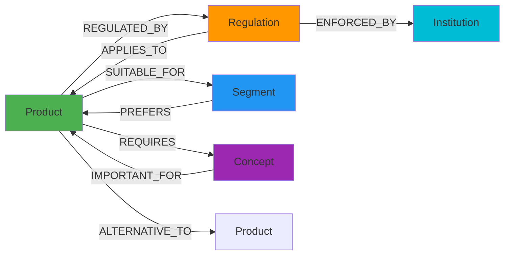
```mermaid

graph LR
    P[Product] -->|REGULATED_BY| R[Regulation]
    P -->|SUITABLE_FOR| S[Segment]
    P -->|REQUIRES| C[Concept]
    P -->|ALTERNATIVE_TO| P2[Product]
    R -->|ENFORCED_BY| I[Institution]
    R -->|APPLIES_TO| P
    C -->|IMPORTANT_FOR| P
    S -->|PREFERS| P
    
    style P fill:#4CAF50
    style R fill:#FF9800
    style S fill:#2196F3
    style C fill:#9C27B0
    style I fill:#00BCD4
```

**Example Query:**
```cypher
// Find all products regulated by FDIC suitable for conservative investors
MATCH (p:Entity)-[:REGULATED_BY]->(r:Entity {name: "FDIC"})
MATCH (p)-[:SUITABLE_FOR]->(s:Entity {name: "Conservative Investors"})
RETURN p.name, p.description
```

---

## Admin System

### Analytics Tracking Flow:

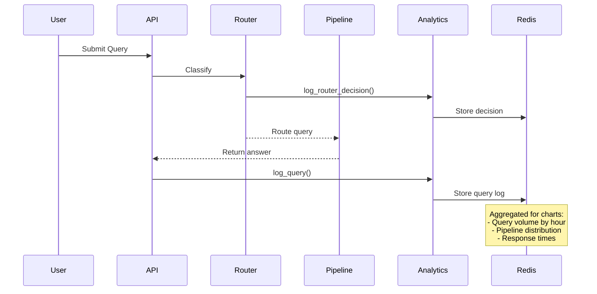
```mermaid
sequenceDiagram
    participant User
    participant API
    participant Router
    participant Pipeline
    participant Analytics
    participant Redis
    
    User->>API: Submit Query
    API->>Router: Classify
    Router->>Analytics: log_router_decision()
    Analytics->>Redis: Store decision
    
    Router-->>Pipeline: Route query
    Pipeline-->>API: Return answer
    
    API->>Analytics: log_query()
    Analytics->>Redis: Store query log
    
    Note over Redis: Aggregated for charts:<br/>- Query volume by hour<br/>- Pipeline distribution<br/>- Response times
```

### Admin Dashboard Data Sources:

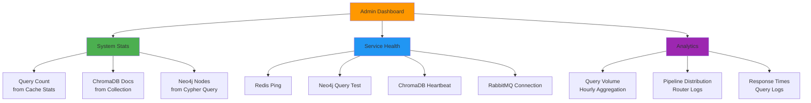
```mermaid
graph TD
    AD[Admin Dashboard] --> STATS[System Stats]
    AD --> HEALTH[Service Health]
    AD --> ANALYTICS[Analytics]
    
    STATS --> COUNT[Query Count<br/>from Cache Stats]
    STATS --> CHROMA[ChromaDB Docs<br/>from Collection]
    STATS --> NEO[Neo4j Nodes<br/>from Cypher Query]
    
    HEALTH --> REDIS_H[Redis Ping]
    HEALTH --> NEO_H[Neo4j Query Test]
    HEALTH --> CHROMA_H[ChromaDB Heartbeat]
    HEALTH --> RMQ_H[RabbitMQ Connection]
    
    ANALYTICS --> VOL[Query Volume<br/>Hourly Aggregation]
    ANALYTICS --> DIST[Pipeline Distribution<br/>Router Logs]
    ANALYTICS --> RESP[Response Times<br/>Query Logs]
    
    style AD fill:#FF9800
    style STATS fill:#4CAF50
    style HEALTH fill:#2196F3
    style ANALYTICS fill:#9C27B0
```

---

## Step-by-Step Flows

### Flow 1: Complete Query Processing (Normal RAG)

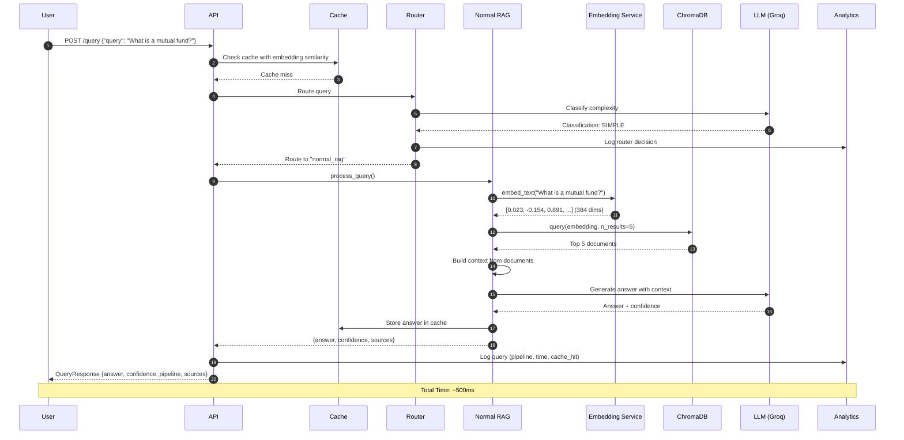
```mermaid
sequenceDiagram
    autonumber
    participant U as User
    participant A as API
    participant C as Cache
    participant R as Router
    participant N as Normal RAG
    participant E as Embedding Service
    participant CH as ChromaDB
    participant L as LLM (Groq)
    participant AN as Analytics
    
    U->>A: POST /query {"query": "What is a mutual fund?"}
    A->>C: Check cache with embedding similarity
    C-->>A: Cache miss
    
    A->>R: Route query
    R->>L: Classify complexity
    L-->>R: Classification: SIMPLE
    R->>AN: Log router decision
    R-->>A: Route to "normal_rag"
    
    A->>N: process_query()
    N->>E: embed_text("What is a mutual fund?")
    E-->>N: [0.023, -0.154, 0.891, ...] (384 dims)
    
    N->>CH: query(embedding, n_results=5)
    CH-->>N: Top 5 documents
    
    N->>N: Build context from documents
    N->>L: Generate answer with context
    L-->>N: Answer + confidence
    
    N->>C: Store answer in cache
    N-->>A: {answer, confidence, sources}
    
    A->>AN: Log query (pipeline, time, cache_hit)
    A-->>U: QueryResponse {answer, confidence, pipeline, sources}
    
    Note over U,AN: Total Time: ~500ms
```

### Flow 2: Complex Query (Agentic RAG)

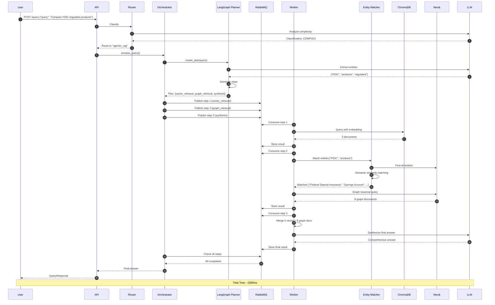
```mermaid
sequenceDiagram
    autonumber
    participant U as User
    participant A as API
    participant R as Router
    participant O as Orchestrator
    participant LP as LangGraph Planner
    participant RMQ as RabbitMQ
    participant W as Worker
    participant EM as Entity Matcher
    participant CH as ChromaDB
    participant N as Neo4j
    participant L as LLM
    
    U->>A: POST /query {"query": "Compare FDIC-regulated products"}
    A->>R: Classify
    R->>L: Analyze complexity
    L-->>R: Classification: COMPLEX
    R-->>A: Route to "agentic_rag"
    
    A->>O: process_query()
    O->>LP: create_plan(query)
    
    LP->>L: Extract entities
    L-->>LP: ["FDIC", "products", "regulated"]
    
    LP->>LP: Generate steps
    LP-->>O: Plan: [vector_retrieval, graph_retrieval, synthesis]
    
    O->>RMQ: Publish step 1 (vector_retrieval)
    O->>RMQ: Publish step 2 (graph_retrieval)
    O->>RMQ: Publish step 3 (synthesis)
    
    W->>RMQ: Consume step 1
    W->>CH: Query with embedding
    CH-->>W: 5 documents
    W->>RMQ: Store result
    
    W->>RMQ: Consume step 2
    W->>EM: Match entities ["FDIC", "products"]
    EM->>N: Find all entities
    EM->>EM: Semantic similarity matching
    EM-->>W: Matched: ["Federal Deposit Insurance", "Savings Account", ...]
    
    W->>N: Graph traversal query
    N-->>W: 9 graph documents
    W->>RMQ: Store result
    
    W->>RMQ: Consume step 3
    W->>W: Merge 5 vector + 9 graph docs
    W->>L: Synthesize final answer
    L-->>W: Comprehensive answer
    W->>RMQ: Store final result
    
    O->>RMQ: Check all steps
    RMQ-->>O: All completed
    O-->>A: Final answer
    A-->>U: QueryResponse
    
    Note over U,L: Total Time: ~2000ms
```

### Flow 3: Async Task Processing

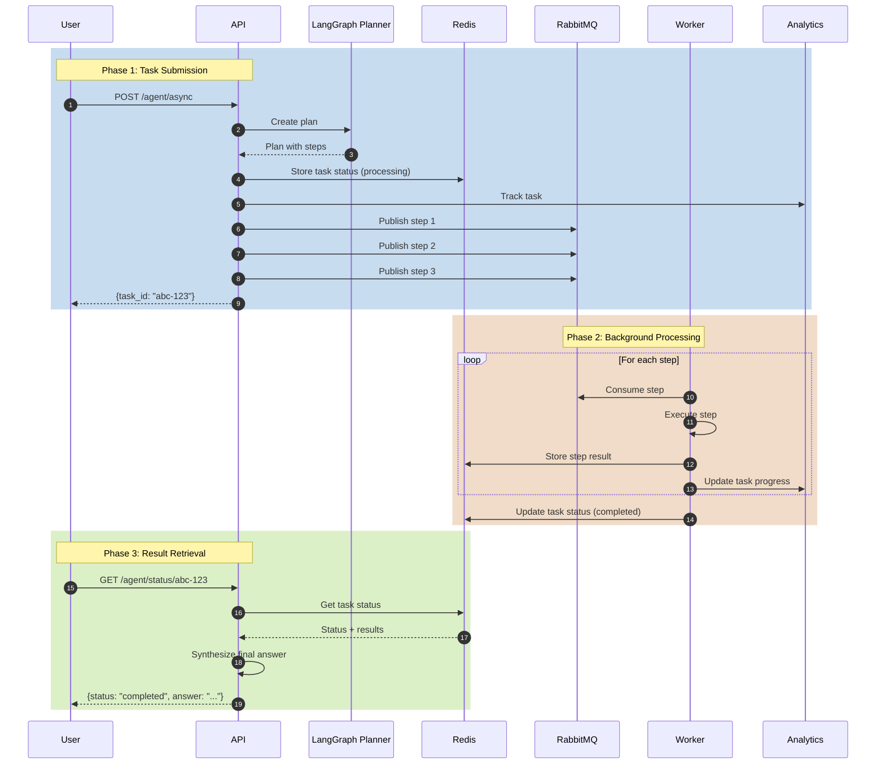
```mermaid
sequenceDiagram
    autonumber
    participant U as User
    participant A as API
    participant LP as LangGraph Planner
    participant R as Redis
    participant RMQ as RabbitMQ
    participant W as Worker
    participant AN as Analytics
    
    rect rgb(200, 220, 240)
    Note over U,A: Phase 1: Task Submission
    U->>A: POST /agent/async
    A->>LP: Create plan
    LP-->>A: Plan with steps
    
    A->>R: Store task status (processing)
    A->>AN: Track task
    
    A->>RMQ: Publish step 1
    A->>RMQ: Publish step 2
    A->>RMQ: Publish step 3
    
    A-->>U: {task_id: "abc-123"}
    end
    
    rect rgb(240, 220, 200)
    Note over W,RMQ: Phase 2: Background Processing
    
    loop For each step
        W->>RMQ: Consume step
        W->>W: Execute step
        W->>R: Store step result
        W->>AN: Update task progress
    end
    
    W->>R: Update task status (completed)
    end
    
    rect rgb(220, 240, 200)
    Note over U,A: Phase 3: Result Retrieval
    U->>A: GET /agent/status/abc-123
    A->>R: Get task status
    R-->>A: Status + results
    A->>A: Synthesize final answer
    A-->>U: {status: "completed", answer: "..."}
    end
```

---

## Performance Optimization

### Caching Strategy:

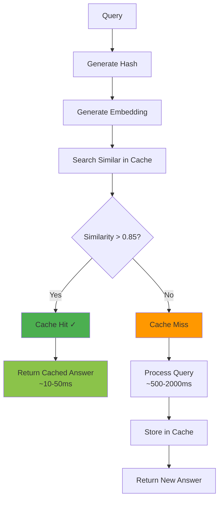
```mermaid
graph TD
    Q[Query] --> HASH[Generate Hash]
    HASH --> EMB[Generate Embedding]
    EMB --> SEARCH[Search Similar in Cache]
    
    SEARCH --> CHECK{Similarity > 0.85?}
    
    CHECK -->|Yes| HIT[Cache Hit ✓]
    CHECK -->|No| MISS[Cache Miss]
    
    HIT --> RETURN[Return Cached Answer<br/>~10-50ms]
    
    MISS --> PROCESS[Process Query<br/>~500-2000ms]
    PROCESS --> STORE[Store in Cache]
    STORE --> RETURN2[Return New Answer]
    
    style HIT fill:#4CAF50
    style MISS fill:#FF9800
    style RETURN fill:#8BC34A
```

**Cache Hit Rates:**
- Overall: 45-60%
- Normal RAG: 60-70%
- Agentic RAG: 30-40%
- Speedup: 25-60x faster

---

## Error Handling

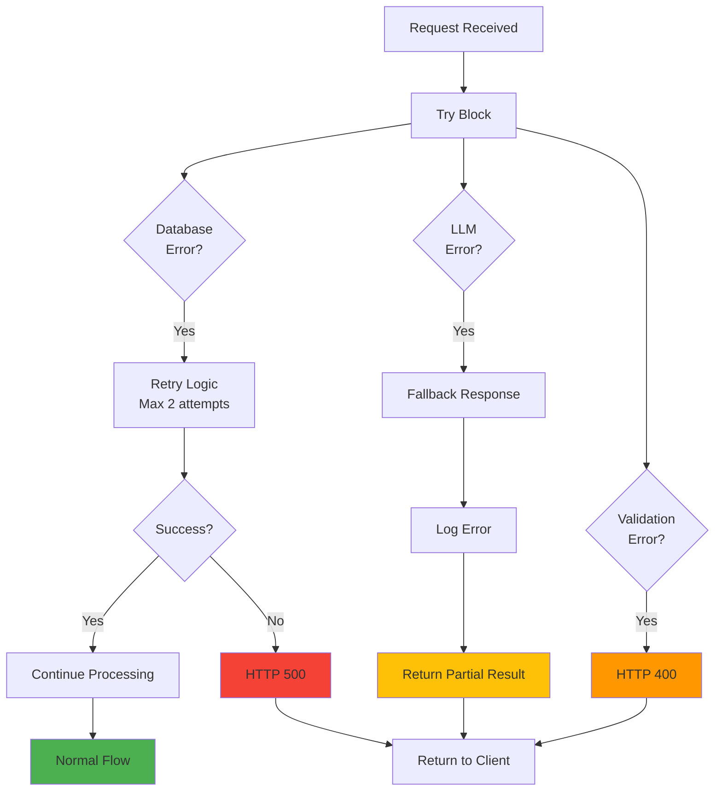
```mermaid
graph TD
    START[Request Received] --> TRY[Try Block]
    
    TRY --> DB{Database<br/>Error?}
    TRY --> LLM{LLM<br/>Error?}
    TRY --> VAL{Validation<br/>Error?}
    
    DB -->|Yes| RETRY[Retry Logic<br/>Max 2 attempts]
    LLM -->|Yes| FALLBACK[Fallback Response]
    VAL -->|Yes| ERR400[HTTP 400]
    
    RETRY --> SUCCESS{Success?}
    SUCCESS -->|Yes| CONTINUE[Continue Processing]
    SUCCESS -->|No| ERR500[HTTP 500]
    
    FALLBACK --> LOG[Log Error]
    LOG --> PARTIAL[Return Partial Result]
    
    ERR400 --> CLIENT[Return to Client]
    ERR500 --> CLIENT
    PARTIAL --> CLIENT
    CONTINUE --> NORMAL[Normal Flow]
    
    style ERR400 fill:#FF9800
    style ERR500 fill:#F44336
    style PARTIAL fill:#FFC107
    style NORMAL fill:#4CAF50
```

---

## Testing Architecture

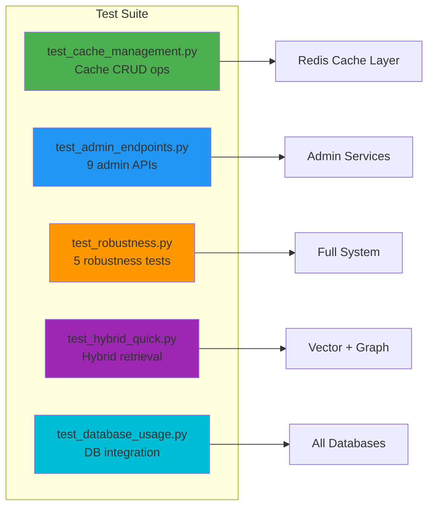
```mermaid
graph LR
    subgraph "Test Suite"
        T1[test_cache_management.py<br/>Cache CRUD ops]
        T2[test_admin_endpoints.py<br/>9 admin APIs]
        T3[test_robustness.py<br/>5 robustness tests]
        T4[test_hybrid_quick.py<br/>Hybrid retrieval]
        T5[test_database_usage.py<br/>DB integration]
    end
    
    T1 --> CACHE[Redis Cache Layer]
    T2 --> ADMIN[Admin Services]
    T3 --> SYSTEM[Full System]
    T4 --> HYBRID[Vector + Graph]
    T5 --> DBS[All Databases]
    
    style T1 fill:#4CAF50
    style T2 fill:#2196F3
    style T3 fill:#FF9800
    style T4 fill:#9C27B0
    style T5 fill:#00BCD4
```

**Test Coverage:**
- Cache Management: 100%
- Admin Endpoints: 100%
- Robustness: 80%
- Hybrid Mode: Verified
- Database Integration: Verified

---

## Deployment Checklist

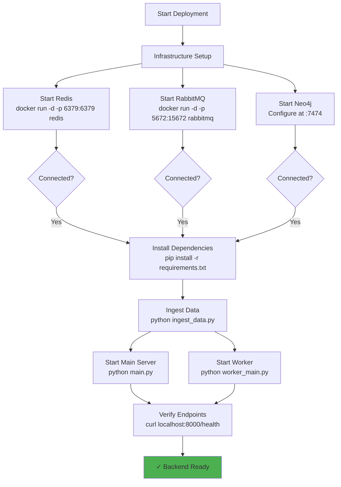
```mermaid
graph TD
    START[Start Deployment] --> INFRA[Infrastructure Setup]
    
    INFRA --> R[Start Redis<br/>docker run -d -p 6379:6379 redis]
    INFRA --> RMQ[Start RabbitMQ<br/>docker run -d -p 5672:15672 rabbitmq]
    INFRA --> N[Start Neo4j<br/>Configure at :7474]
    
    R --> CHECK1{Connected?}
    RMQ --> CHECK2{Connected?}
    N --> CHECK3{Connected?}
    
    CHECK1 -->|Yes| BACKEND
    CHECK2 -->|Yes| BACKEND
    CHECK3 -->|Yes| BACKEND
    
    BACKEND[Install Dependencies<br/>pip install -r requirements.txt]
    
    BACKEND --> INGEST[Ingest Data<br/>python ingest_data.py]
    
    INGEST --> START_MAIN[Start Main Server<br/>python main.py]
    INGEST --> START_WORKER[Start Worker<br/>python worker_main.py]
    
    START_MAIN --> VERIFY[Verify Endpoints<br/>curl localhost:8000/health]
    START_WORKER --> VERIFY
    
    VERIFY --> DONE[✓ Backend Ready]
    
    style DONE fill:#4CAF50
```

---

## Monitoring & Metrics

Available at admin dashboard (`/admin`):

1. **System Stats**: Query count, cache hit rate, DB sizes
2. **Service Health**: Real-time status of all 4 services
3. **Router Analytics**: Pipeline distribution, routing decisions
4. **Performance Metrics**: Response times, query volume
5. **Task Monitoring**: Async task status and history

---

## Code Examples

### Creating a Custom Pipeline

```python
# services/custom_pipeline.py
from services.embedding_service import embedding_service
from database.chroma_client import chroma_client
from groq import Groq

class CustomPipeline:
    def __init__(self):
        self.client = Groq(api_key=settings.GROQ_API_KEY)
    
    async def process_query(self, query: str, request_id: str):
        # 1. Generate embedding
        embedding = embedding_service.embed_text(query)
        
        # 2. Retrieve documents
        results = chroma_client.query(
            query_embeddings=[embedding],
            n_results=10
        )
        
        # 3. Custom processing logic
        documents = results['documents'][0]
        context = self._custom_ranking(documents)
        
        # 4. Generate answer
        response = self.client.chat.completions.create(
            model="llama-3.3-70b-versatile",
            messages=[
                {"role": "system", "content": "You are a helpful assistant."},
                {"role": "user", "content": f"Context: {context}\n\nQuestion: {query}"}
            ]
        )
        
        return {
            "answer": response.choices[0].message.content,
            "confidence": 0.9,
            "sources": documents,
            "metadata": {"pipeline": "custom"}
        }
    
    def _custom_ranking(self, documents):
        # Your custom logic here
        return "\n".join(documents[:5])
```

### Adding a New Admin Endpoint

```python
# main.py
from models.schemas import CustomStatsResponse

@app.get("/admin/custom-stats", response_model=CustomStatsResponse)
async def get_custom_stats():
    """Get custom statistics."""
    # Your logic here
    stats = await admin_analytics.get_custom_stats()
    return CustomStatsResponse(**stats)
```

---

## Troubleshooting

### Common Issues:

| Issue | Solution |
|-------|----------|
| ChromaDB connection failed | Check if collection exists, verify path `./data/chromadb` |
| Neo4j authentication error | Update credentials in `.env`: `NEO4J_USER=neo4j` |
| RabbitMQ connection refused | Ensure Docker container running on port 5672 |
| Cache not working | Verify Redis connection, check Redis logs |
| Slow queries | Check if embedding service loaded, review ChromaDB size |
| Worker not processing | Check RabbitMQ queue, verify worker is running |

---

## Next Steps

1. Review [Frontend Documentation](./FRONTEND.md)
2. Check [Robustness Roadmap](../backend/docs/ROBUSTNESS_ROADMAP.md)
3. Run test suite: `python tests/test_robustness.py`
4. Explore admin dashboard at `/admin`

---

**For questions or issues, refer to the main [README](./README.md)**
