# Frontend Architecture - User & Admin Dashboards

## Table of Contents
1. [Overview](#overview)
2. [Technology Stack](#technology-stack)
3. [Project Structure](#project-structure)
4. [User Dashboard](#user-dashboard)
5. [Admin Dashboard](#admin-dashboard)
6. [Routing & Navigation](#routing--navigation)
7. [API Integration](#api-integration)

---

## Overview

The Niyanta frontend is a modern **React + Vite** application with **Tailwind CSS** for styling. It provides two main interfaces:

1. **User Dashboard** - Query interface for end users
2. **Admin Dashboard** - System monitoring and management

### Design Philosophy

- **Clean & Minimal**: No unnecessary elements, focus on functionality
- **Dark Theme**: Professional appearance matching modern applications
- **Responsive**: Works on desktop and tablet devices
- **Fast**: Vite for instant hot module replacement (HMR)

---

## Technology Stack

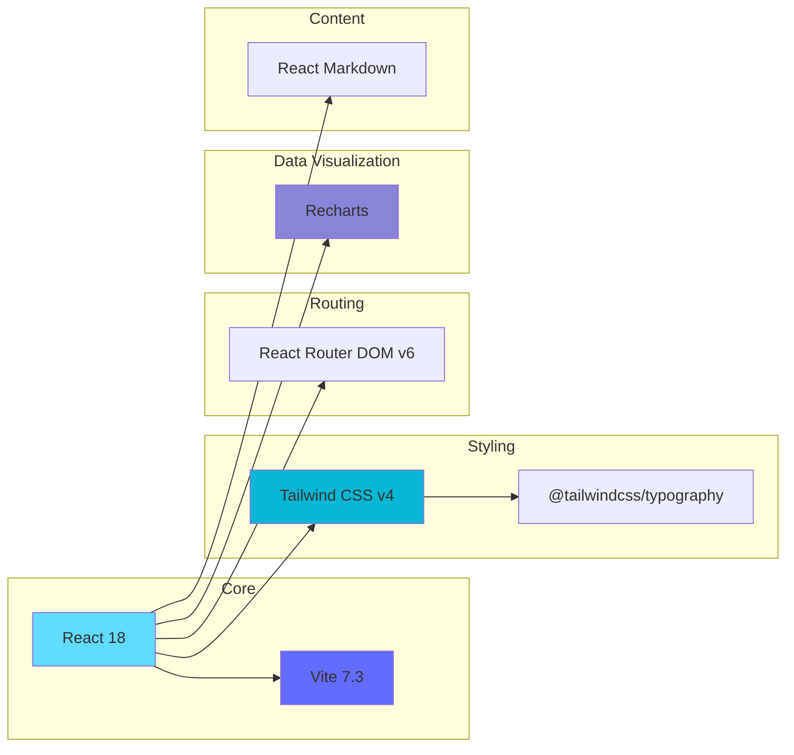

**Dependencies:**
- `react` v18 - UI library
- `vite` v7.3 - Build tool
- `tailwindcss` v4+ - Styling
- `react-router-dom` v6 - Routing
- `recharts` - Charts and graphs
- `react-markdown` - Markdown rendering
- `@tailwindcss/typography` - Prose styling

---

## Project Structure

```
frontend/
├── public/                  # Static assets
├── src/
│   ├── pages/              # Main page components
│   │   ├── UserDashboard.jsx       # User query interface
│   │   ├── AdminLogin.jsx          # Admin authentication
│   │   └── AdminDashboard.jsx      # Admin main layout
│   │
│   ├── components/         # Reusable components
│   │   └── admin/          # Admin-specific components
│   │       ├── OverviewTab.jsx     # System overview
│   │       ├── DocumentsTab.jsx    # Document management
│   │       ├── CacheTab.jsx        # Cache management
│   │       ├── QueueTab.jsx        # RabbitMQ monitoring
│   │       ├── TasksTab.jsx        # Task management
│   │       └── AnalyticsTab.jsx    # Charts & analytics
│   │
│   ├── App.jsx             # Root component with routing
│   ├── App.css             # Global styles
│   ├── index.css           # Tailwind imports
│   └── main.jsx            # React entry point
│
├── index.html              # HTML template
├── vite.config.js          # Vite configuration
├── tailwind.config.js      # Tailwind configuration (auto-generated)
├── postcss.config.js       # PostCSS configuration (auto-generated)
└── package.json            # Dependencies
```

---

## Application Architecture

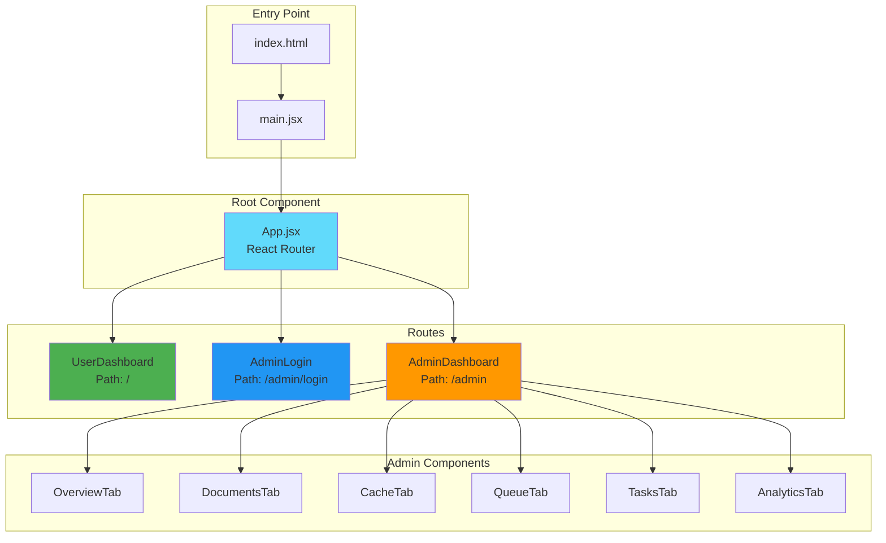

---

## User Dashboard

### Component Structure

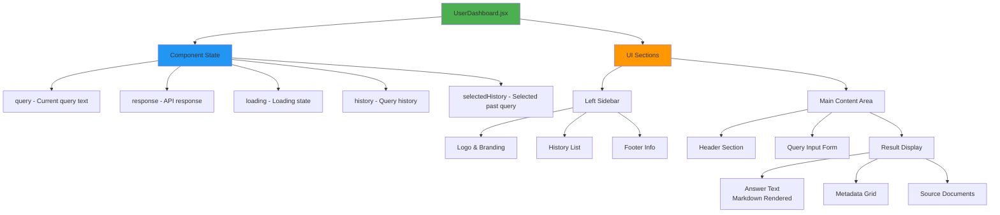

### User Flow

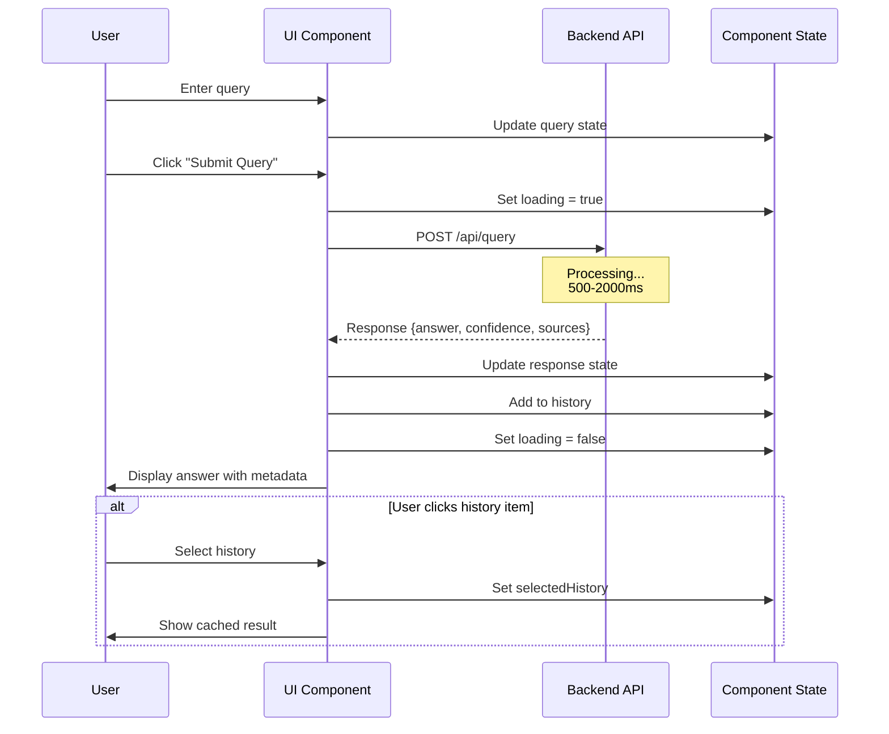

### Key Features

**1. Query Input**
- Large textarea for complex questions
- Real-time character input
- Submit button with loading state
- Disabled state during processing

**2. Response Display**
- Markdown-formatted answer (bold, lists, code blocks)
- Pipeline indicator (Normal RAG / Agentic RAG / Cache)
- Cache hit indicator
- Confidence score bar
- Processing time
- Source document count

**3. Metadata Grid**
```
┌──────────────────┬──────────────────┐
│ Pipeline Mode    │ Cache Status     │
│ normal_rag       │ Cached           │
├──────────────────┼──────────────────┤
│ Confidence       │ Processing Time  │
│ 89.5%            │ 520ms            │
├──────────────────┼──────────────────┤
│ Sources          │                  │
│ 5 documents      │                  │
└──────────────────┴──────────────────┘
```

**4. Source Documents**
- Top 3 sources displayed
- Document preview (truncated)
- Metadata badges (source, type)

**5. Query History**
- Last 20 queries in sidebar
- Click to reload
- Timestamp display
- Pipeline type indicator

---

## Admin Dashboard

### Authentication Flow

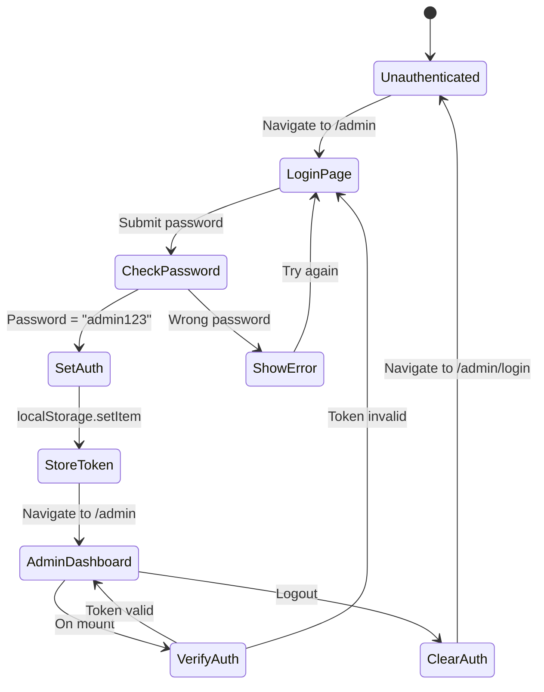

**Security Note:** This is a simple password authentication for demonstration. Production should use:
- JWT tokens
- Backend authentication
- Role-based access control (RBAC)
- Session management

---

### Admin Dashboard Layout

```mermaid
graph LR
    subgraph "Layout Structure"
        direction TB
        
        SIDEBAR[Left Sidebar<br/>320px fixed]
        MAIN[Main Content<br/>Flexible width]
        
        SIDEBAR --> LOGO[Logo Section]
        SIDEBAR --> NAV[Tab Navigation<br/>6 tabs]
        SIDEBAR --> LOGOUT[Logout Button]
        
        MAIN --> HEADER[Page Header]
        MAIN --> CONTENT[Dynamic Tab Content]
        
        NAV --> T1[Overview]
        NAV --> T2[Documents]
        NAV --> T3[Cache]
        NAV --> T4[Queue]
        NAV --> T5[Tasks]
        NAV --> T6[Analytics]
    end
    
    style SIDEBAR fill:#1a1a1a
    style MAIN fill:#000000
```

---

### Admin Tabs

#### 1. Overview Tab

**Purpose:** System health and key metrics at a glance

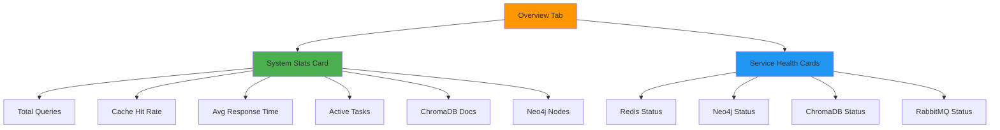

**Data Sources:**
- `GET /admin/stats` - Overall statistics
- `GET /admin/health-detailed` - Service health checks

**Update Frequency:** Every 5 seconds (auto-refresh)

**Metrics Displayed:**
```
System Statistics
├── Total Queries: 1,234
├── Cache Hit Rate: 56.7%
├── Avg Response Time: 620ms
├── Active Tasks: 3
├── ChromaDB Documents: 100
└── Neo4j Nodes: 56

Service Health
├── ✓ Redis: Healthy
├── ✓ Neo4j: Healthy
├── ✓ ChromaDB: Healthy
└── ✓ RabbitMQ: Healthy
```

---

#### 2. Documents Tab

**Purpose:** Ingest new documents into ChromaDB

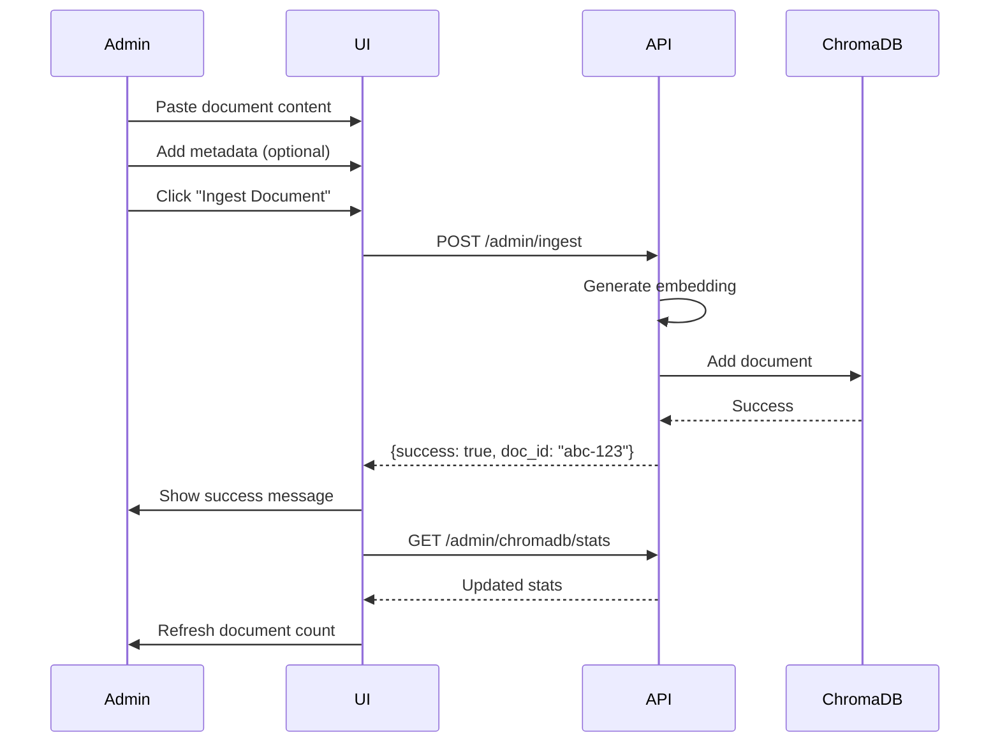

**Form Fields:**
```
┌─────────────────────────────────────┐
│ Document Content *                  │
│ ┌─────────────────────────────────┐ │
│ │ Enter document text here...     │ │
│ │                                 │ │
│ └─────────────────────────────────┘ │
│                                     │
│ Metadata (JSON, optional)           │
│ ┌─────────────────────────────────┐ │
│ │ {"source": "manual",            │ │
│ │  "type": "product"}             │ │
│ └─────────────────────────────────┘ │
│                                     │
│ [Ingest Document]                   │
└─────────────────────────────────────┘
```

**Current Database Stats:**
- Total Documents: 100
- Collections: ["financial_services"]
- Collection Sizes: {financial_services: 100}

---

#### 3. Cache Tab

**Purpose:** Manage semantic cache

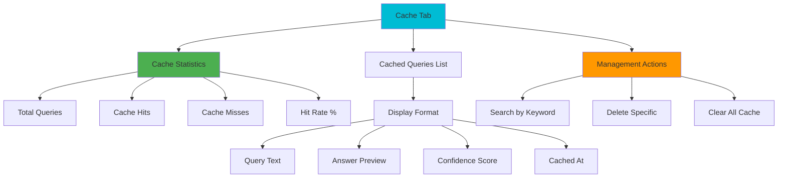

**Operations:**

1. **View Statistics**
   - `GET /cache/stats`
   - Updates every 5 seconds

2. **List Cached Queries**
   - `GET /cache/keys?limit=20`
   - Paginated display

3. **Search Cache**
   - `GET /cache/search?q=keyword`
   - Client-side filtering

4. **Delete Entry**
   - `DELETE /cache/query?query=...`
   - Confirmation dialog

5. **Clear All**
   - `POST /cache/clear`
   - Confirmation required
   - Returns deleted count

---

#### 4. Queue Tab

**Purpose:** Monitor RabbitMQ queue status

**Display:**
```
RabbitMQ Queue Status
├── Queue Name: agent_step_queue
├── Messages Ready: 12
├── Messages Unacknowledged: 3
├── Active Consumers: 1
└── Total Messages: 15

Actions:
[Refresh Status] [View Queue Details]
```

**Data Source:** `GET /admin/rabbitmq/status`

**Note:** Full queue management requires RabbitMQ Management API

---

#### 5. Tasks Tab

**Purpose:** Monitor and manage async tasks

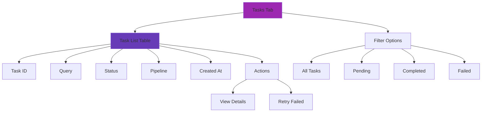

**Table Format:**
```
┌──────────┬────────────────┬───────────┬──────────┬─────────────┬─────────┐
│ Task ID  │ Query          │ Status    │ Pipeline │ Created At  │ Actions │
├──────────┼────────────────┼───────────┼──────────┼─────────────┼─────────┤
│ abc-123  │ Compare FDIC...│ Completed │ agentic  │ 2:30 PM     │ [View]  │
│ def-456  │ What is...     │ Failed    │ agentic  │ 2:25 PM     │ [Retry] │
│ ghi-789  │ List all...    │ Processing│ agentic  │ 2:20 PM     │ [View]  │
└──────────┴────────────────┴───────────┴──────────┴─────────────┴─────────┘
```

**APIs Used:**
- `GET /admin/tasks` - List all tasks
- `GET /admin/tasks?status=failed` - Filter by status
- `POST /admin/tasks/{task_id}/retry` - Retry failed task

---

#### 6. Analytics Tab

**Purpose:** Visual analytics with charts

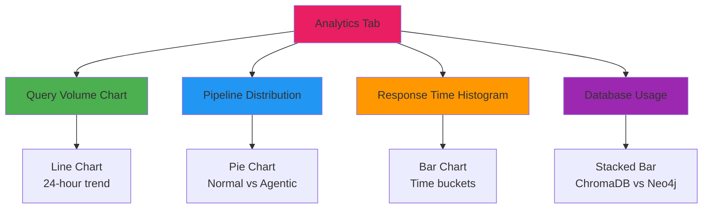

**Charts:**

1. **Query Volume (Line Chart)**
   - X-axis: Time (hourly buckets)
   - Y-axis: Query count
   - Data: Last 24 hours

2. **Pipeline Distribution (Pie Chart)**
   - Normal RAG: % and count
   - Agentic RAG: % and count
   - Colors: Blue (Normal), Purple (Agentic)

3. **Response Times (Bar Chart)**
   - X-axis: Time buckets (0-500ms, 500-1000ms, 1000-2000ms, 2000ms+)
   - Y-axis: Query count
   - Shows distribution

4. **Database Usage (Stacked Bar)**
   - ChromaDB only
   - Neo4j only  
   - Hybrid (both)

**Data Source:** `GET /admin/analytics`

**Update:** Manual refresh button

---

## Routing & Navigation

### Route Configuration

```javascript
<BrowserRouter>
  <Routes>
    <Route path="/" element={<UserDashboard />} />
    <Route path="/admin/login" element={<AdminLogin />} />
    <Route path="/admin" element={<AdminDashboard />} />
  </Routes>
</BrowserRouter>
```

### Protected Route Pattern

```javascript
// AdminDashboard.jsx
useEffect(() => {
  const isAuthenticated = localStorage.getItem('adminAuth');
  if (!isAuthenticated) {
    navigate('/admin/login');
  }
}, [navigate]);
```

---

## API Integration

### API Proxy Configuration

**Vite Config:**
```javascript
// vite.config.js
export default defineConfig({
  server: {
    proxy: {
      '/api': {
        target: 'http://localhost:8000',
        changeOrigin: true,
        rewrite: (path) => path.replace(/^\/api/, ''),
      },
    },
  },
});
```

**Usage in Components:**
```javascript
// Frontend makes request to /api/query
fetch('/api/query', {...})

// Vite proxies to http://localhost:8000/query
```

### API Call Pattern

```javascript
// Example: User Query
const handleSubmit = async (e) => {
  e.preventDefault();
  setLoading(true);
  
  try {
    const response = await fetch('/api/query', {
      method: 'POST',
      headers: { 'Content-Type': 'application/json' },
      body: JSON.stringify({
        query: query,
        use_cache: true,
        force_agentic: false,
      }),
    });
    
    if (!response.ok) throw new Error(`HTTP ${response.status}`);
    
    const data = await response.json();
    setResponse(data);
  } catch (error) {
    setError(error.message);
  } finally {
    setLoading(false);
  }
};
```

---

## Styling System

### Tailwind Configuration

**Key Classes Used:**

| Purpose | Classes |
|---------|---------|
| Layout | `flex`, `flex-col`, `grid`, `grid-cols-2` |
| Spacing | `p-4`, `px-6`, `py-3`, `gap-4`, `space-y-2` |
| Colors | `bg-black`, `bg-gray-950`, `text-white`, `text-gray-400` |
| Borders | `border`, `border-gray-800`, `rounded`, `rounded-lg` |
| Typography | `text-sm`, `text-lg`, `font-bold`, `uppercase` |
| States | `hover:bg-gray-900`, `disabled:opacity-50` |

### Color Palette

```
Background:
├── Primary: #000000 (black)
├── Secondary: #0a0a0a (gray-950)
├── Tertiary: #1a1a1a (gray-900)
└── Borders: #262626 (gray-800)

Text:
├── Primary: #ffffff (white)
├── Secondary: #9ca3af (gray-400)
├── Tertiary: #6b7280 (gray-500)
└── Muted: #4b5563 (gray-600)

Accent:
├── Success: #4CAF50 (green)
├── Error: #F44336 (red)
├── Warning: #FF9800 (orange)
└── Info: #2196F3 (blue)
```

---

## Component Patterns

### State Management

```javascript
// Local state with useState
const [data, setData] = useState(null);
const [loading, setLoading] = useState(false);
const [error, setError] = useState(null);

// Auto-refresh pattern
useEffect(() => {
  const interval = setInterval(() => {
    fetchData();
  }, 5000);
  
  return () => clearInterval(interval);
}, []);
```

### Loading States

```javascript
{loading ? (
  <div className="flex items-center gap-2">
    <div className="w-5 h-5 border-2 border-white border-t-transparent rounded-full animate-spin" />
    <span>Loading...</span>
  </div>
) : (
  <div>Content</div>
)}
```

### Error Handling

```javascript
{error && (
  <div className="p-4 bg-red-950/50 border border-red-900 rounded text-red-400">
    Error: {error}
  </div>
)}
```

---

## Build & Deployment

### Development

```bash
npm run dev
# Starts dev server on http://localhost:5173
# Hot module replacement (HMR) enabled
```

### Production Build

```bash
npm run build
# Creates optimized build in dist/
# Minified and tree-shaken
# Ready for deployment
```

### Preview Production Build

```bash
npm run preview
# Serves production build locally
# Test before deployment
```

---

## Performance Optimizations

1. **Vite Features:**
   - Instant HMR
   - Lazy route loading
   - Code splitting

2. **React Optimizations:**
   - Memoization where needed
   - Efficient re-renders
   - Component lazy loading

3. **API Optimizations:**
   - Request debouncing
   - Response caching
   - Optimistic UI updates

---

## Browser Support

- Chrome/Edge: 90+
- Firefox: 88+
- Safari: 14+

**Required Features:**
- ES6+ support
- Fetch API
- CSS Grid
- Flexbox

---

## Future Enhancements

1. **Real-time Updates:**
   - WebSocket for live metrics
   - Server-sent events for notifications

2. **Advanced Features:**
   - Query history export
   - Bulk document upload
   - Advanced search filters

3. **UI Improvements:**
   - Dark/light theme toggle
   - Customizable dashboard
   - Keyboard shortcuts

---

## Development Guidelines

### Adding a New Tab

1. Create component in `src/components/admin/NewTab.jsx`
2. Add to AdminDashboard tabs array
3. Add to switch statement in renderTab()
4. Create API endpoint if needed

### Styling Guidelines

- Use Tailwind utility classes
- Follow existing color scheme
- Maintain consistent spacing (4px grid)
- Test responsive behavior

---

## Troubleshooting

| Issue | Solution |
|-------|----------|
| API calls fail | Check proxy config, verify backend running |
| Styles not working | Rebuild Tailwind, check class names |
| Routing not working | Verify BrowserRouter, check route paths |
| Charts not displaying | Install recharts, check data format |
| Markdown not rendering | Install react-markdown, check syntax |

---

**For backend integration details, see [BACKEND.md](./BACKEND.md)**
