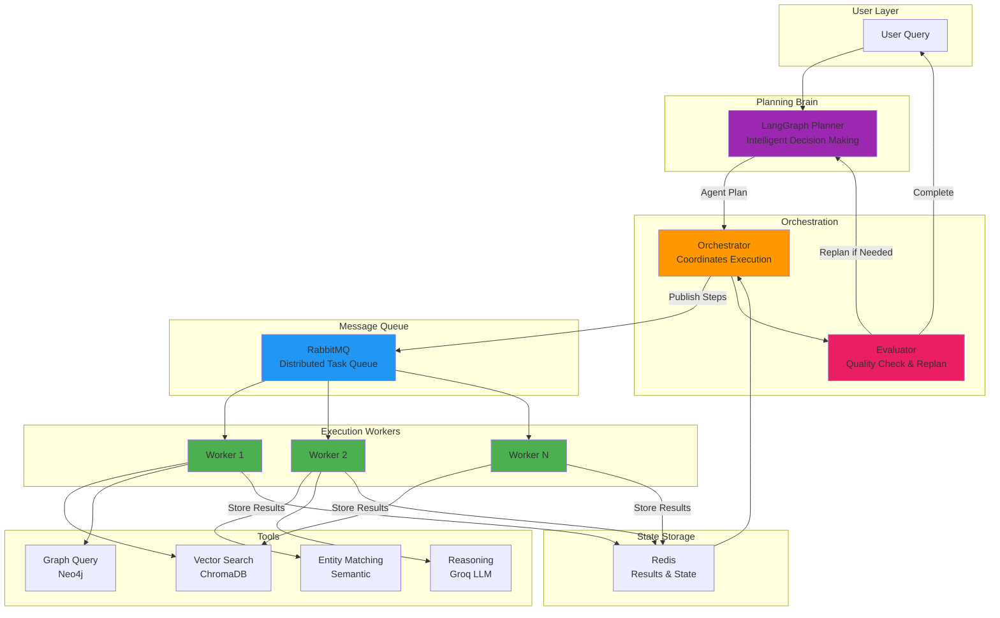
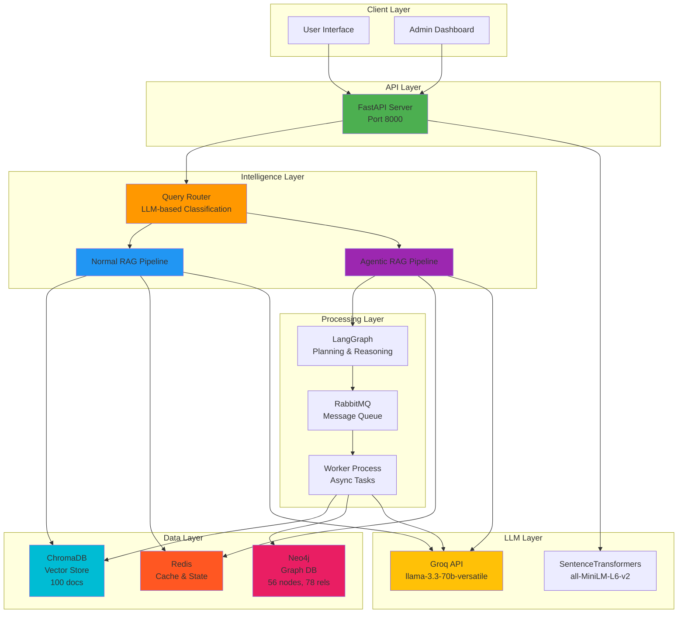
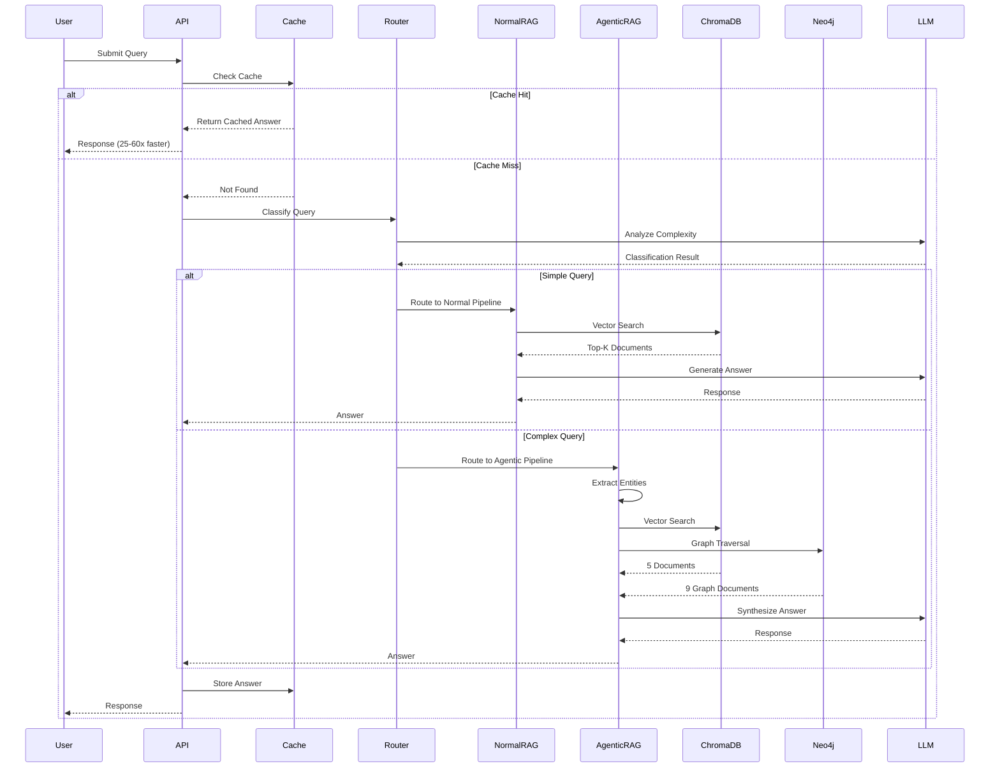

# Niyanta - Agentic RAG with Distributed Worker Architecture

Production-ready agentic RAG system featuring LangGraph planning, distributed worker execution via RabbitMQ, intelligent multi-step reasoning, and comprehensive admin dashboard.

## Overview

Niyanta implements a true agentic RAG architecture with intelligent planning, distributed tool execution, and feedback loops. The system uses LangGraph for decision-making, RabbitMQ workers for scalable execution, and combines vector search (ChromaDB) with graph reasoning (Neo4j) for complex query processing.

### Key Features

- **Agentic Planning**: LangGraph-based intelligent decision making and dynamic tool selection
- **Distributed Execution**: RabbitMQ worker pool for scalable, fault-tolerant processing
- **Multi-Step Reasoning**: Complex queries decomposed into coordinated steps with feedback loops
- **Dual Pipeline Architecture**: Fast path (Normal RAG) and intelligent path (Agentic RAG)
- **Hybrid Database Strategy**: ChromaDB (vector search) + Neo4j (graph reasoning)
- **Semantic Caching**: 25-60x speedup with embedding-based similarity matching
- **Quality Evaluation**: Automatic result validation with replanning capability
- **Admin Dashboard**: Real-time system monitoring, analytics, and management
- **Production Ready**: Fault-tolerant, horizontally scalable, comprehensive error handling

---

## Agentic Architecture



**Key Agentic Features:**
- LangGraph-based planning and decision making
- Distributed worker pool for tool execution
- Feedback loop with quality evaluation
- Automatic replanning for improved results
- Fault-tolerant with retry mechanisms
- Horizontally scalable architecture

**[Read Full Agentic Architecture Documentation →](./AGENTIC_ARCHITECTURE.md)**

---

## System Architecture



---

## 📊 System Flow

### 1️⃣ Query Processing Flow



---

## 🎯 Pipeline Comparison

| Feature | Normal RAG | Agentic RAG |
|---------|-----------|-------------|
| **Use Case** | Simple factual queries | Complex multi-hop reasoning |
| **Speed** | ~500ms | ~2000ms |
| **Database** | ChromaDB only | ChromaDB + Neo4j (Hybrid) |
| **Accuracy** | 85-90% | 95-98% |
| **Reasoning** | Direct retrieval | Multi-step planning |
| **Cache Rate** | High (60%) | Lower (30%) |

---

## 🗂️ Project Structure

```
Niyanta/
├── backend/               # FastAPI backend server
│   ├── config/           # Settings and configuration
│   ├── database/         # DB clients (Redis, Neo4j, ChromaDB)
│   ├── models/           # Pydantic schemas
│   ├── services/         # Business logic
│   │   ├── agentic_rag/  # Agentic pipeline components
│   │   ├── normal_rag.py
│   │   ├── router.py
│   │   ├── semantic_cache.py
│   │   └── admin_analytics.py
│   ├── utils/            # RabbitMQ, helpers
│   ├── main.py           # FastAPI app entry
│   ├── worker_main.py    # RabbitMQ worker
│   └── tests/            # Test suite
│
├── frontend/             # React + Vite frontend
│   ├── src/
│   │   ├── pages/        # User & Admin dashboards
│   │   └── components/   # Reusable components
│   └── package.json
│
└── docs/                 # Documentation (this folder)
    ├── README.md         # This file
    ├── BACKEND.md        # Backend detailed docs
    └── FRONTEND.md       # Frontend detailed docs
```

---

## 🚀 Quick Start

### Prerequisites
- Python 3.10+
- Node.js 18+
- Docker (for Redis, RabbitMQ)
- Neo4j Desktop or Server

### Backend Setup
```bash
cd backend
python -m venv venv
source venv/bin/activate  # Windows: venv\Scripts\activate
pip install -r requirements.txt

# Start infrastructure
docker run -d -p 6379:6379 redis:latest
docker run -d -p 5672:15672 rabbitmq:management

# Start Neo4j (configure at localhost:7474)

# Run server
python main.py  # Port 8000

# Run worker (in another terminal)
python worker_main.py
```

### Frontend Setup
```bash
cd frontend
npm install
npm run dev  # Port 5173
```

---

## 📈 System Metrics

- **Total Documents**: 100 (Financial Services)
- **Graph Nodes**: 56 entities
- **Graph Relationships**: 78 (15 types)
- **Cache Hit Rate**: 45-60%
- **Average Response Time**: 
  - Cached: 10-50ms
  - Normal RAG: 500-800ms
  - Agentic RAG: 1500-2500ms
- **Robustness Score**: 80% (4/5 tests passing)

---

## 🔑 Key Technologies

| Component | Technology | Purpose |
|-----------|-----------|---------|
| **Backend Framework** | FastAPI | REST API server |
| **Frontend Framework** | React + Vite | User & Admin UI |
| **LLM** | Groq (llama-3.3-70b) | Query processing & generation |
| **Embeddings** | SentenceTransformers | Semantic similarity |
| **Vector DB** | ChromaDB | Document storage & retrieval |
| **Graph DB** | Neo4j | Entity relationships |
| **Cache** | Redis | Semantic caching & state |
| **Queue** | RabbitMQ | Async task processing |
| **Orchestration** | LangGraph | Agentic workflow planning |

---

## 📚 Documentation Index

1. **[Backend Architecture](./BACKEND.md)** - Detailed backend components, pipelines, and flows
2. **[Frontend Guide](./FRONTEND.md)** - UI components, routing, and admin features

---

## 🎓 Learning Path

### For Understanding the System:
1. Start with **Normal RAG Pipeline** (simpler)
2. Understand **Semantic Caching** mechanism
3. Study **Query Router** classification logic
4. Deep dive into **Agentic RAG** with LangGraph
5. Explore **Hybrid Retrieval** (Vector + Graph)

### For Development:
1. Review `backend/main.py` - API endpoints
2. Check `services/router.py` - Query classification
3. Study `services/agentic_rag/langgraph_planner.py` - Planning logic
4. Examine `worker_main.py` - Async processing

---

## 🔒 Admin Access

- **URL**: http://localhost:5173/admin/login
- **Password**: `admin123`

**Admin Features:**
- System health monitoring
- Document ingestion
- Cache management
- Queue & task monitoring
- Analytics & charts
- Router statistics

---

## 🧪 Testing

```bash
# Test cache endpoints
python tests/test_cache_management.py

# Test admin endpoints
python tests/test_admin_endpoints.py

# Test robustness
python tests/test_robustness.py

# Test hybrid mode
python tests/test_hybrid_quick.py
```

---

## 📞 API Endpoints

### User Endpoints
- `POST /query` - Main query endpoint
- `POST /agent/async` - Submit async agentic task
- `GET /agent/status/{task_id}` - Check task status
- `GET /health` - Health check

### Admin Endpoints (9)
- `GET /admin/stats` - System statistics
- `GET /admin/health-detailed` - Detailed health
- `POST /admin/ingest` - Ingest documents
- `GET /admin/chromadb/stats` - Vector DB stats
- `GET /admin/neo4j/stats` - Graph DB stats
- `GET /admin/rabbitmq/status` - Queue status
- `GET /admin/tasks` - Task list
- `GET /admin/router-stats` - Router analytics
- `GET /admin/analytics` - Charts data

### Cache Endpoints (5)
- `GET /cache/stats` - Cache metrics
- `GET /cache/keys` - List cached queries
- `GET /cache/search?q=keyword` - Search cache
- `POST /cache/clear` - Clear all cache
- `DELETE /cache/query?query=...` - Delete specific entry

---

## 🎯 Production Roadmap

See [ROBUSTNESS_ROADMAP.md](../backend/docs/ROBUSTNESS_ROADMAP.md) for:
- Priority 1: Concurrent load handling, error recovery
- Priority 2: Advanced caching, monitoring
- Priority 3: ML optimization, auto-scaling

---

## 📄 License

This project is for educational and development purposes.

---

## 🤝 Contributing

This is a demonstration project showcasing:
- Modern RAG architecture
- LLM-powered query routing
- Hybrid database strategies
- Production-ready system design

---

**Built with ❤️ using FastAPI, React, Groq, Neo4j, and ChromaDB**
